# ARCHITECTURE FLOW OVERVIEW - Solution Argent Rapide

**Date:** 2026-01-22
**Version:** 2.0.0
**Statut:** Documentation Complete

---

## TABLE DES MATIERES

1. [C4 Model - Context Level](#1-c4-model---context-level)
2. [C4 Model - Container Level](#2-c4-model---container-level)
3. [C4 Model - Component Level](#3-c4-model---component-level)
4. [Technology Stack Diagram](#4-technology-stack-diagram)
5. [Data Flow Architecture](#5-data-flow-architecture)
6. [Security Architecture](#6-security-architecture)
7. [Deployment Architecture](#7-deployment-architecture)
8. [Monitoring & Observability](#8-monitoring--observability)
9. [Legends & Notes](#9-legends--notes)

---

## 1. C4 MODEL - CONTEXT LEVEL

Vue globale du systeme SAR et ses interactions avec utilisateurs et systemes externes.

```mermaid
graph TB
    subgraph "Users"
        CLIENT[👤 Client<br/>Demandeur de pret]
        ADMIN[👨‍💼 Admin<br/>Analyste credit]
    end

    subgraph "SAR System"
        SAR[🏦 Solution Argent Rapide<br/>Systeme d'analyse credit automatise]
    end

    subgraph "External Systems"
        VOPAY[💳 VoPay<br/>Paiements EFT/PAD]
        MARGILL[📊 Margill<br/>Gestion de prets]
        QB[💼 QuickBooks<br/>Comptabilite]
        FLINKS[🏧 Flinks/Inverite<br/>Verification bancaire]
        RESEND[📧 Resend<br/>Service email]
        TWILIO[📱 Twilio<br/>SMS notifications]
        GA4[📈 Google Analytics 4<br/>Web analytics]
    end

    CLIENT -->|Remplit formulaire| SAR
    SAR -->|Donnees client| MARGILL
    SAR -->|Redirection verification| FLINKS
    FLINKS -->|Donnees bancaires| SAR
    ADMIN -->|Analyse demandes| SAR
    SAR -->|Transactions paiement| VOPAY
    SAR -->|Sync comptable| QB
    SAR -->|Envoie emails| RESEND
    SAR -->|Envoie SMS| TWILIO
    SAR -->|Track analytics| GA4

    style SAR fill:#4A90E2,stroke:#2E5C8A,color:#FFF
    style CLIENT fill:#7ED321,stroke:#5A9C18,color:#FFF
    style ADMIN fill:#7ED321,stroke:#5A9C18,color:#FFF
    style VOPAY fill:#F5A623,stroke:#C7851B,color:#FFF
    style MARGILL fill:#F5A623,stroke:#C7851B,color:#FFF
    style QB fill:#F5A623,stroke:#C7851B,color:#FFF
    style FLINKS fill:#F5A623,stroke:#C7851B,color:#FFF
    style RESEND fill:#F5A623,stroke:#C7851B,color:#FFF
    style TWILIO fill:#F5A623,stroke:#C7851B,color:#FFF
    style GA4 fill:#F5A623,stroke:#C7851B,color:#FFF
```

---

## 2. C4 MODEL - CONTAINER LEVEL

Detail des containers dans le systeme SAR.

```mermaid
graph TB
    subgraph "Vercel Edge Network"
        direction TB

        subgraph "Next.js Application"
            FRONTEND[🎨 Frontend<br/>React + TypeScript<br/>Public Site + Admin Dashboard]
            API[⚡ API Routes<br/>Next.js Route Handlers<br/>REST APIs]
            MIDDLEWARE[🛡️ Middleware<br/>Auth + Routing<br/>JWT Verification]
        end

        subgraph "Background Processing"
            WORKER[⚙️ Background Workers<br/>Analysis Pipeline<br/>Async Jobs]
            CRON[⏰ Cron Jobs<br/>Scheduled Tasks<br/>GA4 Sync]
        end
    end

    subgraph "Supabase Cloud"
        DB[(🗄️ PostgreSQL<br/>Database<br/>Client Data + Analytics)]
        STORAGE[📦 Storage<br/>File Storage<br/>Documents + Reports]
    end

    subgraph "External Services"
        VOPAY_EXT[💳 VoPay API]
        FLINKS_EXT[🏧 Flinks API]
        QB_EXT[💼 QuickBooks API]
        RESEND_EXT[📧 Resend API]
        GA4_EXT[📈 GA4 API]
    end

    FRONTEND -->|API Calls| API
    FRONTEND -->|Auth Check| MIDDLEWARE
    API -->|Read/Write| DB
    API -->|Upload/Download| STORAGE
    API -->|Create Jobs| WORKER
    WORKER -->|Process Data| DB
    CRON -->|Fetch Metrics| GA4_EXT
    CRON -->|Update DB| DB
    API -->|Payment Requests| VOPAY_EXT
    API -->|Bank Verification| FLINKS_EXT
    API -->|Accounting Sync| QB_EXT
    API -->|Send Emails| RESEND_EXT

    style FRONTEND fill:#4A90E2,stroke:#2E5C8A,color:#FFF
    style API fill:#4A90E2,stroke:#2E5C8A,color:#FFF
    style MIDDLEWARE fill:#4A90E2,stroke:#2E5C8A,color:#FFF
    style WORKER fill:#7ED321,stroke:#5A9C18,color:#FFF
    style CRON fill:#7ED321,stroke:#5A9C18,color:#FFF
    style DB fill:#F5A623,stroke:#C7851B,color:#FFF
    style STORAGE fill:#F5A623,stroke:#C7851B,color:#FFF
    style VOPAY_EXT fill:#D0021B,stroke:#9A0114,color:#FFF
    style FLINKS_EXT fill:#D0021B,stroke:#9A0114,color:#FFF
    style QB_EXT fill:#D0021B,stroke:#9A0114,color:#FFF
    style RESEND_EXT fill:#D0021B,stroke:#9A0114,color:#FFF
    style GA4_EXT fill:#D0021B,stroke:#9A0114,color:#FFF
```

---

## 3. C4 MODEL - COMPONENT LEVEL

Composants principaux de chaque container.

### Frontend Components

```mermaid
graph LR
    subgraph "Public Site Components"
        HOME[🏠 Home Page<br/>Landing + Hero]
        FORM[📝 Loan Form<br/>Margill iframe]
        PAGES[📄 Static Pages<br/>About, FAQ, etc]
    end

    subgraph "Admin Dashboard Components"
        LOGIN[🔐 Login Page<br/>JWT Auth]
        DASH[📊 Dashboard<br/>Metrics + Charts]
        CLIENTS[👥 Client List<br/>Search + Filter]
        ANALYSIS[🔍 Analysis View<br/>Credit Score + Reco]
        VOPAY_UI[💳 VoPay Panel<br/>Transactions]
        QB_UI[💼 QuickBooks Panel<br/>Accounting]
        SETTINGS[⚙️ Settings<br/>Config + Admin]
    end

    HOME --> FORM
    LOGIN --> DASH
    DASH --> CLIENTS
    DASH --> VOPAY_UI
    DASH --> QB_UI
    CLIENTS --> ANALYSIS

    style HOME fill:#4A90E2,stroke:#2E5C8A,color:#FFF
    style FORM fill:#4A90E2,stroke:#2E5C8A,color:#FFF
    style PAGES fill:#4A90E2,stroke:#2E5C8A,color:#FFF
    style LOGIN fill:#4A90E2,stroke:#2E5C8A,color:#FFF
    style DASH fill:#4A90E2,stroke:#2E5C8A,color:#FFF
    style CLIENTS fill:#4A90E2,stroke:#2E5C8A,color:#FFF
    style ANALYSIS fill:#4A90E2,stroke:#2E5C8A,color:#FFF
    style VOPAY_UI fill:#4A90E2,stroke:#2E5C8A,color:#FFF
    style QB_UI fill:#4A90E2,stroke:#2E5C8A,color:#FFF
    style SETTINGS fill:#4A90E2,stroke:#2E5C8A,color:#FFF
```

### API Endpoints

```mermaid
graph TD
    subgraph "Public APIs"
        CONTACT[📧 /api/contact<br/>Contact form]
        SEO[🔍 /api/seo/*<br/>SEO metrics]
    end

    subgraph "Admin APIs"
        ADMIN_LOGIN[🔐 /api/admin/login<br/>Authentication]
        ADMIN_VOPAY[💳 /api/admin/vopay<br/>Payment data]
        ADMIN_CLIENTS[👥 /api/admin/clients<br/>Client CRUD]
        ADMIN_ANALYSIS[🔍 /api/admin/client-analysis<br/>Credit analysis]
        ADMIN_METRICS[📊 /api/admin/metrics/*<br/>Dashboard metrics]
        ADMIN_QB[💼 /api/quickbooks/*<br/>QB integration]
    end

    subgraph "Worker APIs"
        WORKER[⚙️ /api/worker<br/>Job processing]
        CRON_API[⏰ /api/cron/*<br/>Scheduled tasks]
    end

    subgraph "Webhook APIs"
        VOPAY_HOOK[🔔 /api/webhooks/vopay<br/>Payment webhooks]
        QB_HOOK[🔔 /api/webhooks/quickbooks<br/>QB webhooks]
    end

    style CONTACT fill:#7ED321,stroke:#5A9C18,color:#FFF
    style SEO fill:#7ED321,stroke:#5A9C18,color:#FFF
    style ADMIN_LOGIN fill:#4A90E2,stroke:#2E5C8A,color:#FFF
    style ADMIN_VOPAY fill:#4A90E2,stroke:#2E5C8A,color:#FFF
    style ADMIN_CLIENTS fill:#4A90E2,stroke:#2E5C8A,color:#FFF
    style ADMIN_ANALYSIS fill:#4A90E2,stroke:#2E5C8A,color:#FFF
    style ADMIN_METRICS fill:#4A90E2,stroke:#2E5C8A,color:#FFF
    style ADMIN_QB fill:#4A90E2,stroke:#2E5C8A,color:#FFF
    style WORKER fill:#F5A623,stroke:#C7851B,color:#FFF
    style CRON_API fill:#F5A623,stroke:#C7851B,color:#FFF
    style VOPAY_HOOK fill:#D0021B,stroke:#9A0114,color:#FFF
    style QB_HOOK fill:#D0021B,stroke:#9A0114,color:#FFF
```

### Database Schemas

```mermaid
graph TD
    subgraph "Core Tables"
        CLIENTS[👥 client_analyses<br/>Client data + raw_data JSONB]
        JOBS[⚙️ analysis_jobs<br/>Processing queue]
        SCORES[📊 analysis_scores<br/>Credit scores + metrics]
        RECO[✅ analysis_recommendations<br/>Approval decisions]
    end

    subgraph "Activity Tracking"
        ACTIVITY[📝 claude_activity_logs<br/>System activity]
        MEMORY[🧠 claude_memory<br/>Context storage]
    end

    subgraph "Metrics Tables"
        GLOBAL[📈 metrics_global<br/>Global stats]
        CLIENT_M[📊 metrics_clients<br/>Client metrics]
        SEO_M[🔍 seo_metrics<br/>SEO data]
    end

    subgraph "Integration Tables"
        VOPAY_T[💳 vopay_transactions<br/>Payment history]
        WEBHOOKS[🔔 vopay_webhooks<br/>Webhook logs]
        DOWNLOADS[📥 document_downloads<br/>Download tracking]
    end

    CLIENTS -->|1:N| JOBS
    JOBS -->|1:1| SCORES
    SCORES -->|1:1| RECO
    CLIENTS -->|1:N| CLIENT_M

    style CLIENTS fill:#4A90E2,stroke:#2E5C8A,color:#FFF
    style JOBS fill:#4A90E2,stroke:#2E5C8A,color:#FFF
    style SCORES fill:#4A90E2,stroke:#2E5C8A,color:#FFF
    style RECO fill:#4A90E2,stroke:#2E5C8A,color:#FFF
    style ACTIVITY fill:#7ED321,stroke:#5A9C18,color:#FFF
    style MEMORY fill:#7ED321,stroke:#5A9C18,color:#FFF
    style GLOBAL fill:#F5A623,stroke:#C7851B,color:#FFF
    style CLIENT_M fill:#F5A623,stroke:#C7851B,color:#FFF
    style SEO_M fill:#F5A623,stroke:#C7851B,color:#FFF
    style VOPAY_T fill:#D0021B,stroke:#9A0114,color:#FFF
    style WEBHOOKS fill:#D0021B,stroke:#9A0114,color:#FFF
    style DOWNLOADS fill:#D0021B,stroke:#9A0114,color:#FFF
```

---

## 4. TECHNOLOGY STACK DIAGRAM

Toutes les technologies par couche.

```mermaid
graph TB
    subgraph "Frontend Layer"
        REACT[⚛️ React 18.3.1<br/>UI Framework]
        NEXT[▲ Next.js 14.2.35<br/>App Router]
        TS[📘 TypeScript 5.9.3<br/>Type Safety]
        TAILWIND[🎨 Tailwind CSS 3.4.0<br/>Styling]
        FRAMER[🎬 Framer Motion 12.26.2<br/>Animations]
        FORMS[📝 React Hook Form 7.71.1<br/>Form Management]
    end

    subgraph "API Layer"
        API_ROUTES[📡 Next.js API Routes<br/>Route Handlers]
        JWT[🔐 Jose 6.1.3<br/>JWT Auth]
        ZOD[✅ Zod 4.3.5<br/>Schema Validation]
        BCRYPT[🔒 bcryptjs 3.0.3<br/>Password Hashing]
    end

    subgraph "Database Layer"
        SUPABASE[🗄️ Supabase 2.88.0<br/>PostgreSQL Client]
        PG[🐘 PostgreSQL<br/>Relational DB]
        STORAGE_DB[📦 Supabase Storage<br/>File Storage]
    end

    subgraph "External Services Layer"
        VOPAY_S[💳 VoPay API<br/>v2<br/>Payments]
        FLINKS_S[🏧 Flinks/Inverite API<br/>v2<br/>Bank Verification]
        QB_S[💼 QuickBooks API<br/>OAuth2<br/>Accounting]
        RESEND_S[📧 Resend API<br/>Email Service]
        GA4_S[📈 Google Analytics 4<br/>Data API v1<br/>Analytics]
    end

    subgraph "Hosting & Infrastructure Layer"
        VERCEL[🚀 Vercel<br/>Edge Network<br/>Auto Deploy]
        CDN[🌐 Vercel CDN<br/>Static Assets]
        EDGE[⚡ Edge Functions<br/>Serverless]
        DOMAINS[🌍 Custom Domains<br/>admin. + client.]
    end

    subgraph "Development & Testing"
        PLAYWRIGHT[🎭 Playwright 1.57.0<br/>E2E Testing]
        NEWMAN[📮 Newman 6.2.2<br/>API Testing]
        ESLINT[🔍 ESLint<br/>Linting]
    end

    NEXT --> REACT
    NEXT --> TS
    REACT --> TAILWIND
    REACT --> FRAMER
    REACT --> FORMS
    API_ROUTES --> JWT
    API_ROUTES --> ZOD
    API_ROUTES --> BCRYPT
    API_ROUTES --> SUPABASE
    SUPABASE --> PG
    SUPABASE --> STORAGE_DB
    API_ROUTES --> VOPAY_S
    API_ROUTES --> FLINKS_S
    API_ROUTES --> QB_S
    API_ROUTES --> RESEND_S
    API_ROUTES --> GA4_S
    NEXT --> VERCEL
    VERCEL --> CDN
    VERCEL --> EDGE
    VERCEL --> DOMAINS

    style REACT fill:#4A90E2,stroke:#2E5C8A,color:#FFF
    style NEXT fill:#4A90E2,stroke:#2E5C8A,color:#FFF
    style TS fill:#4A90E2,stroke:#2E5C8A,color:#FFF
    style TAILWIND fill:#4A90E2,stroke:#2E5C8A,color:#FFF
    style FRAMER fill:#4A90E2,stroke:#2E5C8A,color:#FFF
    style FORMS fill:#4A90E2,stroke:#2E5C8A,color:#FFF
    style API_ROUTES fill:#7ED321,stroke:#5A9C18,color:#FFF
    style JWT fill:#7ED321,stroke:#5A9C18,color:#FFF
    style ZOD fill:#7ED321,stroke:#5A9C18,color:#FFF
    style BCRYPT fill:#7ED321,stroke:#5A9C18,color:#FFF
    style SUPABASE fill:#F5A623,stroke:#C7851B,color:#FFF
    style PG fill:#F5A623,stroke:#C7851B,color:#FFF
    style STORAGE_DB fill:#F5A623,stroke:#C7851B,color:#FFF
    style VOPAY_S fill:#D0021B,stroke:#9A0114,color:#FFF
    style FLINKS_S fill:#D0021B,stroke:#9A0114,color:#FFF
    style QB_S fill:#D0021B,stroke:#9A0114,color:#FFF
    style RESEND_S fill:#D0021B,stroke:#9A0114,color:#FFF
    style GA4_S fill:#D0021B,stroke:#9A0114,color:#FFF
    style VERCEL fill:#000,stroke:#333,color:#FFF
    style CDN fill:#000,stroke:#333,color:#FFF
    style EDGE fill:#000,stroke:#333,color:#FFF
    style DOMAINS fill:#000,stroke:#333,color:#FFF
    style PLAYWRIGHT fill:#50E3C2,stroke:#3AB399,color:#FFF
    style NEWMAN fill:#50E3C2,stroke:#3AB399,color:#FFF
    style ESLINT fill:#50E3C2,stroke:#3AB399,color:#FFF
```

---

## 5. DATA FLOW ARCHITECTURE

Comment les donnees circulent dans tout le systeme.

```mermaid
flowchart TD
    START([👤 Client visite site]) --> FORM[📝 Remplit formulaire<br/>Margill iframe]
    FORM --> REDIRECT[🔄 Redirection Flinks<br/>app.inverite.com]
    REDIRECT --> BANK[🏧 Connexion bancaire<br/>90 jours transactions]

    BANK --> EXT_COLLECT[🔧 Extension Chrome<br/>Collection auto]

    subgraph "Extension Collection 3 Threads Paralleles"
        EXT_COLLECT --> FETCH[📊 GET /api/v2/fetch<br/>Donnees bancaires]
        EXT_COLLECT --> RISK[🎯 POST /api/v2/risk<br/>Risk Score 300-850]
        EXT_COLLECT --> MICRO[💰 POST /api/v2/microcheck<br/>Payday loans]
    end

    FETCH --> MERGE[🔗 Merge 3 sources]
    RISK --> MERGE
    MICRO --> MERGE

    MERGE --> API_POST[📡 POST /api/admin/client-analysis<br/>Bearer Token Auth]

    API_POST --> VALIDATE[✅ Validate JWT + Data<br/>Extract client info]
    VALIDATE --> DB_INSERT[(💾 INSERT Supabase<br/>client_analyses table)]

    DB_INSERT --> JOB_CREATE[⚙️ CREATE analysis_job<br/>status: pending]
    JOB_CREATE --> API_RESPONSE[✨ Return analysis_id<br/>redirect_url]

    API_RESPONSE --> WORKER_POLL[🔄 Worker polls jobs<br/>Every 5 seconds]
    WORKER_POLL --> WORKER_PROCESS[⚡ Process Pipeline]

    subgraph "Analysis Pipeline"
        WORKER_PROCESS --> LOAD[📥 Load raw_data JSONB]
        LOAD --> METRICS[📊 Calculate Metrics<br/>income, dti, nsf, etc]
        METRICS --> SAR_SCORE[🎯 Calculate SAR Score<br/>300-850]
        SAR_SCORE --> RECO[✅ Generate Recommendation<br/>Approve/Review/Decline]
        RECO --> SAVE[💾 Save Results<br/>scores + recommendations]
    end

    SAVE --> DASHBOARD[📊 Admin Dashboard<br/>Real-time display]

    subgraph "Webhooks & Async"
        VOPAY_WH[🔔 VoPay Webhook<br/>Payment events]
        QB_WH[🔔 QuickBooks Webhook<br/>Accounting events]
        CRON[⏰ Cron Jobs<br/>GA4 sync + cleanup]
    end

    VOPAY_WH --> DB_INSERT
    QB_WH --> DB_INSERT
    CRON --> DB_INSERT

    DASHBOARD --> EXPORT[📥 Export Data<br/>Excel, PDF, etc]

    style START fill:#7ED321,stroke:#5A9C18,color:#FFF
    style FORM fill:#4A90E2,stroke:#2E5C8A,color:#FFF
    style REDIRECT fill:#F5A623,stroke:#C7851B,color:#FFF
    style BANK fill:#F5A623,stroke:#C7851B,color:#FFF
    style EXT_COLLECT fill:#50E3C2,stroke:#3AB399,color:#FFF
    style FETCH fill:#50E3C2,stroke:#3AB399,color:#FFF
    style RISK fill:#50E3C2,stroke:#3AB399,color:#FFF
    style MICRO fill:#50E3C2,stroke:#3AB399,color:#FFF
    style MERGE fill:#50E3C2,stroke:#3AB399,color:#FFF
    style API_POST fill:#4A90E2,stroke:#2E5C8A,color:#FFF
    style VALIDATE fill:#7ED321,stroke:#5A9C18,color:#FFF
    style DB_INSERT fill:#F5A623,stroke:#C7851B,color:#FFF
    style JOB_CREATE fill:#F5A623,stroke:#C7851B,color:#FFF
    style API_RESPONSE fill:#7ED321,stroke:#5A9C18,color:#FFF
    style WORKER_POLL fill:#F5A623,stroke:#C7851B,color:#FFF
    style WORKER_PROCESS fill:#F5A623,stroke:#C7851B,color:#FFF
    style LOAD fill:#F5A623,stroke:#C7851B,color:#FFF
    style METRICS fill:#F5A623,stroke:#C7851B,color:#FFF
    style SAR_SCORE fill:#F5A623,stroke:#C7851B,color:#FFF
    style RECO fill:#F5A623,stroke:#C7851B,color:#FFF
    style SAVE fill:#F5A623,stroke:#C7851B,color:#FFF
    style DASHBOARD fill:#4A90E2,stroke:#2E5C8A,color:#FFF
    style VOPAY_WH fill:#D0021B,stroke:#9A0114,color:#FFF
    style QB_WH fill:#D0021B,stroke:#9A0114,color:#FFF
    style CRON fill:#F5A623,stroke:#C7851B,color:#FFF
    style EXPORT fill:#7ED321,stroke:#5A9C18,color:#FFF
```

---

## 6. SECURITY ARCHITECTURE

Tous les points de securite du systeme.

```mermaid
graph TB
    subgraph "Entry Points"
        USER_REQ[🌐 User Request<br/>HTTPS Only]
    end

    subgraph "Vercel Edge Layer"
        WAF[🛡️ Vercel WAF<br/>DDoS Protection]
        CSP[🔒 CSP Headers<br/>Content Security Policy]
        CORS[🌍 CORS Policy<br/>Allowed origins]
    end

    subgraph "Application Layer"
        MIDDLEWARE[🔐 Middleware<br/>JWT Verification]
        RATE_LIMIT[⏱️ Rate Limiting<br/>API throttling]
        INPUT_VAL[✅ Input Validation<br/>Zod schemas]
    end

    subgraph "Authentication"
        JWT_AUTH[🔑 JWT Tokens<br/>HS256 signing]
        SESSION[🍪 Cookie Session<br/>HttpOnly + Secure]
        BCRYPT_HASH[🔐 Password Hashing<br/>bcrypt rounds=10]
    end

    subgraph "API Security"
        BEARER[🎫 Bearer Tokens<br/>Extension auth]
        API_KEYS[🔑 API Keys<br/>External services]
        WEBHOOK_SIG[✍️ Webhook Signatures<br/>HMAC-SHA256]
    end

    subgraph "Database Security"
        RLS[🛡️ Row Level Security<br/>Supabase RLS]
        ENCRYPTION[🔒 Encryption at Rest<br/>AES-256]
        SSL[🔐 SSL Connections<br/>TLS 1.3]
    end

    subgraph "Monitoring"
        LOGS[📝 Security Logs<br/>Activity tracking]
        ALERTS[🚨 Alert System<br/>Anomaly detection]
        AUDIT[📋 Audit Trail<br/>All actions logged]
    end

    USER_REQ --> WAF
    WAF --> CSP
    CSP --> CORS
    CORS --> MIDDLEWARE
    MIDDLEWARE --> RATE_LIMIT
    RATE_LIMIT --> INPUT_VAL
    INPUT_VAL --> JWT_AUTH
    JWT_AUTH --> SESSION
    SESSION --> BCRYPT_HASH
    BCRYPT_HASH --> BEARER
    BEARER --> API_KEYS
    API_KEYS --> WEBHOOK_SIG
    WEBHOOK_SIG --> RLS
    RLS --> ENCRYPTION
    ENCRYPTION --> SSL
    SSL --> LOGS
    LOGS --> ALERTS
    ALERTS --> AUDIT

    style USER_REQ fill:#7ED321,stroke:#5A9C18,color:#FFF
    style WAF fill:#D0021B,stroke:#9A0114,color:#FFF
    style CSP fill:#D0021B,stroke:#9A0114,color:#FFF
    style CORS fill:#D0021B,stroke:#9A0114,color:#FFF
    style MIDDLEWARE fill:#F5A623,stroke:#C7851B,color:#FFF
    style RATE_LIMIT fill:#F5A623,stroke:#C7851B,color:#FFF
    style INPUT_VAL fill:#F5A623,stroke:#C7851B,color:#FFF
    style JWT_AUTH fill:#4A90E2,stroke:#2E5C8A,color:#FFF
    style SESSION fill:#4A90E2,stroke:#2E5C8A,color:#FFF
    style BCRYPT_HASH fill:#4A90E2,stroke:#2E5C8A,color:#FFF
    style BEARER fill:#50E3C2,stroke:#3AB399,color:#FFF
    style API_KEYS fill:#50E3C2,stroke:#3AB399,color:#FFF
    style WEBHOOK_SIG fill:#50E3C2,stroke:#3AB399,color:#FFF
    style RLS fill:#D0021B,stroke:#9A0114,color:#FFF
    style ENCRYPTION fill:#D0021B,stroke:#9A0114,color:#FFF
    style SSL fill:#D0021B,stroke:#9A0114,color:#FFF
    style LOGS fill:#F5A623,stroke:#C7851B,color:#FFF
    style ALERTS fill:#F5A623,stroke:#C7851B,color:#FFF
    style AUDIT fill:#F5A623,stroke:#C7851B,color:#FFF
```

### Security Measures Detail

| Layer | Measure | Implementation | Status |
|-------|---------|----------------|--------|
| **Network** | HTTPS Enforcement | Vercel automatic | ✅ Active |
| **Network** | DDoS Protection | Vercel WAF | ✅ Active |
| **Network** | CSP Headers | next.config.js | ✅ Active |
| **Application** | JWT Auth | Jose library | ✅ Active |
| **Application** | Rate Limiting | API middleware | ⚠️ Partial |
| **Application** | Input Validation | Zod schemas | ✅ Active |
| **Authentication** | Password Hashing | bcryptjs | ✅ Active |
| **Authentication** | Session Management | HttpOnly cookies | ✅ Active |
| **API** | Bearer Tokens | Extension auth | ✅ Active |
| **API** | Webhook Signatures | HMAC validation | ✅ Active |
| **Database** | RLS Policies | Supabase | ✅ Active |
| **Database** | Encryption at Rest | Supabase default | ✅ Active |
| **Database** | SSL Connections | TLS 1.3 | ✅ Active |
| **Monitoring** | Activity Logs | claude_activity_logs | ✅ Active |
| **Monitoring** | Error Tracking | Vercel logs | ✅ Active |

---

## 7. DEPLOYMENT ARCHITECTURE

Infrastructure de deploiement.

```mermaid
graph TB
    subgraph "Git Repository"
        GITHUB[📦 GitHub Repository<br/>github.com/user/sar]
    end

    subgraph "CI/CD Pipeline"
        PUSH[🚀 git push]
        VERCEL_BUILD[⚙️ Vercel Build<br/>Automatic trigger]
        TESTS[🧪 Run Tests<br/>ESLint + Build]
    end

    subgraph "Vercel Edge Network"
        direction TB

        subgraph "Production"
            PROD_MAIN[🌐 solutionargentrapide.ca<br/>Main Domain]
            PROD_ADMIN[👨‍💼 admin.solutionargentrapide.ca<br/>Admin Subdomain]
            PROD_CLIENT[👤 client.solutionargentrapide.ca<br/>Client Subdomain]
        end

        subgraph "Preview"
            PREVIEW[👁️ sar-nu.vercel.app<br/>Preview URL]
            PREVIEW_LIVE[🔴 vercel.live<br/>Live Preview]
        end

        subgraph "Edge Functions"
            EDGE_NA[🌍 North America]
            EDGE_EU[🌍 Europe]
            EDGE_ASIA[🌍 Asia]
        end
    end

    subgraph "CDN Layer"
        STATIC[📦 Static Assets<br/>JS, CSS, Images]
        CACHE[💾 Edge Cache<br/>ISR Pages]
    end

    subgraph "External Infrastructure"
        SUPABASE_CLOUD[☁️ Supabase Cloud<br/>us-east-1<br/>PostgreSQL]
        DNS[🌐 DNS Provider<br/>Domain management]
    end

    GITHUB --> PUSH
    PUSH --> VERCEL_BUILD
    VERCEL_BUILD --> TESTS
    TESTS -->|✅ Success| PROD_MAIN
    TESTS -->|✅ Success| PROD_ADMIN
    TESTS -->|✅ Success| PROD_CLIENT
    TESTS -->|🔍 Branch| PREVIEW

    PROD_MAIN --> EDGE_NA
    PROD_MAIN --> EDGE_EU
    PROD_MAIN --> EDGE_ASIA

    PROD_ADMIN --> EDGE_NA
    PROD_CLIENT --> EDGE_NA

    EDGE_NA --> STATIC
    EDGE_EU --> STATIC
    EDGE_ASIA --> STATIC

    STATIC --> CACHE

    PROD_MAIN --> SUPABASE_CLOUD
    PROD_ADMIN --> SUPABASE_CLOUD
    PROD_CLIENT --> SUPABASE_CLOUD

    DNS --> PROD_MAIN
    DNS --> PROD_ADMIN
    DNS --> PROD_CLIENT

    style GITHUB fill:#000,stroke:#333,color:#FFF
    style PUSH fill:#7ED321,stroke:#5A9C18,color:#FFF
    style VERCEL_BUILD fill:#000,stroke:#333,color:#FFF
    style TESTS fill:#50E3C2,stroke:#3AB399,color:#FFF
    style PROD_MAIN fill:#4A90E2,stroke:#2E5C8A,color:#FFF
    style PROD_ADMIN fill:#4A90E2,stroke:#2E5C8A,color:#FFF
    style PROD_CLIENT fill:#4A90E2,stroke:#2E5C8A,color:#FFF
    style PREVIEW fill:#F5A623,stroke:#C7851B,color:#FFF
    style PREVIEW_LIVE fill:#F5A623,stroke:#C7851B,color:#FFF
    style EDGE_NA fill:#000,stroke:#333,color:#FFF
    style EDGE_EU fill:#000,stroke:#333,color:#FFF
    style EDGE_ASIA fill:#000,stroke:#333,color:#FFF
    style STATIC fill:#50E3C2,stroke:#3AB399,color:#FFF
    style CACHE fill:#50E3C2,stroke:#3AB399,color:#FFF
    style SUPABASE_CLOUD fill:#F5A623,stroke:#C7851B,color:#FFF
    style DNS fill:#D0021B,stroke:#9A0114,color:#FFF
```

### Deployment Configuration

| Environment | URL | Branch | Auto Deploy |
|-------------|-----|--------|-------------|
| **Production** | solutionargentrapide.ca | main | ✅ Yes |
| **Production** | admin.solutionargentrapide.ca | main | ✅ Yes |
| **Production** | client.solutionargentrapide.ca | main | ✅ Yes |
| **Preview** | sar-nu.vercel.app | main | ✅ Yes |
| **Preview** | vercel.live/* | feature/* | ✅ Yes |

### Environment Variables

```bash
# Deployment
VERCEL_ENV=production
VERCEL_URL=auto-generated
VERCEL_REGION=iad1

# Database
SUPABASE_URL=https://xxx.supabase.co
SUPABASE_ANON_KEY=xxx
SUPABASE_SERVICE_ROLE_KEY=xxx

# Authentication
JWT_SECRET=xxx
ADMIN_PASSWORD=xxx

# External APIs
VOPAY_ACCOUNT_ID=xxx
VOPAY_API_KEY=xxx
VOPAY_SHARED_SECRET=xxx

QUICKBOOKS_CLIENT_ID=xxx
QUICKBOOKS_CLIENT_SECRET=xxx

RESEND_API_KEY=xxx

GA4_PROPERTY_ID=xxx
GA4_CREDENTIALS=xxx
```

---

## 8. MONITORING & OBSERVABILITY

Systeme de monitoring et logs.

```mermaid
graph TB
    subgraph "Application Events"
        USER_ACTION[👤 User Actions<br/>Clicks, Forms, Navigation]
        API_CALL[📡 API Calls<br/>Request/Response]
        ERROR[❌ Errors<br/>Exceptions, Failures]
        PERFORMANCE[⚡ Performance<br/>Load times, Metrics]
    end

    subgraph "Logging System"
        ACTIVITY_LOG[📝 Activity Logger<br/>claude_activity_logs table]
        ERROR_LOG[🚨 Error Logger<br/>Vercel logs]
        PERF_LOG[⏱️ Performance Logger<br/>Middleware tracking]
    end

    subgraph "Analytics Platforms"
        GA4_ANALYTICS[📈 Google Analytics 4<br/>User behavior + conversions]
        CUSTOM_METRICS[📊 Custom Metrics<br/>metrics_global table]
        SEO_METRICS[🔍 SEO Metrics<br/>seo_metrics table]
    end

    subgraph "Monitoring Dashboard"
        ADMIN_DASH[📊 Admin Dashboard<br/>Real-time stats]
        METRIC_INSPECTOR[🔍 Metric Inspector<br/>Deep dive analytics]
        VERCEL_DASH[☁️ Vercel Dashboard<br/>Infrastructure metrics]
    end

    subgraph "Aggregation & Alerts"
        CRON_SYNC[⏰ Cron Jobs<br/>GA4 sync every hour]
        CALC_GLOBAL[🔢 Calculate Global<br/>Aggregate metrics]
        ALERT_SYSTEM[🚨 Alert System<br/>Threshold monitoring]
    end

    USER_ACTION --> ACTIVITY_LOG
    API_CALL --> ACTIVITY_LOG
    ERROR --> ERROR_LOG
    PERFORMANCE --> PERF_LOG

    ACTIVITY_LOG --> CUSTOM_METRICS
    ERROR_LOG --> VERCEL_DASH
    PERF_LOG --> CUSTOM_METRICS

    USER_ACTION --> GA4_ANALYTICS
    GA4_ANALYTICS --> CRON_SYNC
    CRON_SYNC --> CUSTOM_METRICS
    CUSTOM_METRICS --> CALC_GLOBAL

    CALC_GLOBAL --> ADMIN_DASH
    CUSTOM_METRICS --> METRIC_INSPECTOR
    SEO_METRICS --> ADMIN_DASH

    ADMIN_DASH --> ALERT_SYSTEM
    CALC_GLOBAL --> ALERT_SYSTEM

    style USER_ACTION fill:#7ED321,stroke:#5A9C18,color:#FFF
    style API_CALL fill:#4A90E2,stroke:#2E5C8A,color:#FFF
    style ERROR fill:#D0021B,stroke:#9A0114,color:#FFF
    style PERFORMANCE fill:#F5A623,stroke:#C7851B,color:#FFF
    style ACTIVITY_LOG fill:#50E3C2,stroke:#3AB399,color:#FFF
    style ERROR_LOG fill:#D0021B,stroke:#9A0114,color:#FFF
    style PERF_LOG fill:#F5A623,stroke:#C7851B,color:#FFF
    style GA4_ANALYTICS fill:#4A90E2,stroke:#2E5C8A,color:#FFF
    style CUSTOM_METRICS fill:#F5A623,stroke:#C7851B,color:#FFF
    style SEO_METRICS fill:#50E3C2,stroke:#3AB399,color:#FFF
    style ADMIN_DASH fill:#4A90E2,stroke:#2E5C8A,color:#FFF
    style METRIC_INSPECTOR fill:#4A90E2,stroke:#2E5C8A,color:#FFF
    style VERCEL_DASH fill:#000,stroke:#333,color:#FFF
    style CRON_SYNC fill:#F5A623,stroke:#C7851B,color:#FFF
    style CALC_GLOBAL fill:#F5A623,stroke:#C7851B,color:#FFF
    style ALERT_SYSTEM fill:#D0021B,stroke:#9A0114,color:#FFF
```

### Metrics Collected

| Category | Metric | Source | Frequency | Storage |
|----------|--------|--------|-----------|---------|
| **Traffic** | Page Views | GA4 | Real-time | GA4 + metrics_global |
| **Traffic** | Unique Visitors | GA4 | Real-time | GA4 + metrics_global |
| **Traffic** | Session Duration | GA4 | Real-time | GA4 + metrics_global |
| **Conversions** | Form Submissions | GA4 | Real-time | GA4 + metrics_global |
| **Conversions** | Applications Started | Custom | Real-time | metrics_global |
| **Conversions** | Applications Completed | Custom | Real-time | metrics_global |
| **Performance** | API Response Time | Middleware | Real-time | claude_activity_logs |
| **Performance** | Page Load Time | GA4 | Real-time | GA4 |
| **Performance** | Database Query Time | Custom | Real-time | claude_activity_logs |
| **Business** | VoPay Balance | VoPay API | On-demand | metrics_global |
| **Business** | Active Loans | Custom | Real-time | metrics_global |
| **Business** | NSF Rate | Custom | Daily | metrics_global |
| **SEO** | Organic Traffic | GA4 | Daily | seo_metrics |
| **SEO** | Keyword Rankings | Custom | Weekly | seo_metrics |
| **SEO** | Backlinks | Custom | Weekly | seo_metrics |
| **System** | Error Rate | Vercel | Real-time | Vercel logs |
| **System** | CPU Usage | Vercel | Real-time | Vercel logs |
| **System** | Memory Usage | Vercel | Real-time | Vercel logs |

### Log Retention

| Log Type | Retention Period | Storage Location |
|----------|------------------|------------------|
| Activity Logs | 90 days | claude_activity_logs table |
| Error Logs | 30 days | Vercel logs |
| Performance Logs | 30 days | claude_activity_logs table |
| GA4 Data | 14 months | Google Analytics |
| Metrics Snapshots | 1 year | metrics_global table |
| Webhook Logs | 90 days | vopay_webhooks table |

---

## 9. LEGENDS & NOTES

### Color Coding

```mermaid
graph LR
    FRONTEND[🔵 Frontend Components<br/>React, Next.js, UI]
    BACKEND[🟢 Backend/API<br/>API Routes, Logic]
    DATABASE[🟠 Database<br/>Supabase, Storage]
    EXTERNAL[🔴 External Services<br/>VoPay, Flinks, QB, etc]
    INFRA[⚫ Infrastructure<br/>Vercel, CDN, DNS]
    TESTING[🔵 Testing & Dev<br/>Playwright, Newman]

    style FRONTEND fill:#4A90E2,stroke:#2E5C8A,color:#FFF
    style BACKEND fill:#7ED321,stroke:#5A9C18,color:#FFF
    style DATABASE fill:#F5A623,stroke:#C7851B,color:#FFF
    style EXTERNAL fill:#D0021B,stroke:#9A0114,color:#FFF
    style INFRA fill:#000,stroke:#333,color:#FFF
    style TESTING fill:#50E3C2,stroke:#3AB399,color:#FFF
```

### Technology Versions (as of 2026-01-22)

| Technology | Version | Release Date | Notes |
|------------|---------|--------------|-------|
| Next.js | 14.2.35 | 2024 | App Router, React Server Components |
| React | 18.3.1 | 2024 | Concurrent features, Suspense |
| TypeScript | 5.9.3 | 2024 | Latest stable |
| Node.js | 20.x LTS | 2023 | Vercel default runtime |
| PostgreSQL | 15.x | 2023 | Supabase managed |
| Supabase JS | 2.88.0 | 2024 | Latest client library |
| Tailwind CSS | 3.4.0 | 2024 | Latest stable |
| Playwright | 1.57.0 | 2025 | E2E testing |

### Scalability Points

| Component | Current | Max Capacity | Scaling Strategy | Bottleneck Risk |
|-----------|---------|--------------|------------------|-----------------|
| **Vercel Functions** | ~100 req/min | 1000 req/min | Auto-scaling | ⚠️ Medium |
| **Database Connections** | ~20 concurrent | 100 concurrent | Connection pooling | ⚠️ Medium |
| **Supabase Storage** | ~10 GB | 100 GB | Upgrade plan | ✅ Low |
| **VoPay API** | ~50 req/min | 500 req/min | Rate limiting | ⚠️ Medium |
| **Flinks API** | ~30 req/min | 300 req/min | Queue system | 🔴 High |
| **Worker Jobs** | ~10/min | 100/min | Multiple workers | ⚠️ Medium |
| **GA4 API** | ~100 req/day | 10000 req/day | Batch requests | ✅ Low |

### Known Bottlenecks

1. **Flinks/Inverite API Rate Limiting**
   - Current: 30 requests/minute
   - Impact: Analysis queue during peak hours
   - Solution: Implement job queue with retry logic
   - Priority: HIGH

2. **Database JSONB Queries**
   - Current: ~200ms for complex queries on raw_data
   - Impact: Dashboard load times
   - Solution: Create materialized views + indexes
   - Priority: MEDIUM

3. **Extension Collection Timeout**
   - Current: 60s max wait for risk score
   - Impact: User experience in admin
   - Solution: Implement async polling UI
   - Priority: MEDIUM

4. **Webhook Processing**
   - Current: Synchronous processing
   - Impact: Timeout on large payloads
   - Solution: Queue-based async processing
   - Priority: LOW

### Architecture Decisions (ADR)

| Decision | Rationale | Trade-offs | Status |
|----------|-----------|------------|--------|
| **Next.js App Router** | Modern RSC, better performance | Learning curve | ✅ Adopted |
| **Supabase over Custom DB** | Managed service, faster dev | Vendor lock-in | ✅ Adopted |
| **JSONB for raw_data** | Flexibility, no schema changes | Query performance | ✅ Adopted |
| **Chrome Extension Collection** | Auto-collection, no API limits | Requires manual admin action | ✅ Adopted |
| **Vercel Hosting** | Auto-deploy, Edge network | Cost at scale | ✅ Adopted |
| **JWT over Session DB** | Stateless, scalable | Token management | ✅ Adopted |
| **Background Workers** | Async processing, better UX | Additional complexity | 🔄 In Progress |
| **Materialized Views** | Fast queries, better perf | Refresh overhead | 📋 Planned |

### Security Notes

1. **Never commit .env files** - All credentials in Vercel environment
2. **JWT_SECRET rotation** - Plan to rotate every 90 days
3. **Admin password** - Currently single password, plan for multi-user auth
4. **API rate limiting** - Partial implementation, needs completion
5. **Webhook signature validation** - Implemented for VoPay, needs QB

### Performance Targets

| Metric | Target | Current | Status |
|--------|--------|---------|--------|
| **Home Page Load** | < 2s | 1.8s | ✅ Met |
| **Dashboard Load** | < 3s | 4.2s | ⚠️ Needs improvement |
| **API Response** | < 500ms | 350ms avg | ✅ Met |
| **Analysis Pipeline** | < 10s | 5-8s | ✅ Met |
| **Database Query** | < 100ms | 150ms avg | ⚠️ Needs optimization |
| **Lighthouse Score** | > 90 | 94 | ✅ Met |

---

## SUMMARY

Ce document fournit une vue d'ensemble complete de l'architecture du systeme SAR:

- **8 diagrammes C4/Mermaid** couvrant tous les niveaux d'abstraction
- **Technology Stack complet** avec versions
- **Data Flow** de bout en bout
- **Security Architecture** multi-couches
- **Deployment Infrastructure** sur Vercel
- **Monitoring & Observability** avec metriques cles
- **Scalability analysis** avec bottlenecks identifies
- **Performance targets** et statut actuel

### Points Cles

1. **Architecture Moderne:** Next.js 14 + App Router + React 18
2. **Backend Robuste:** Supabase PostgreSQL + JSONB flexibility
3. **Securite Multi-Couches:** JWT + CSP + RLS + Encryption
4. **Integration Complete:** VoPay, Flinks, QuickBooks, GA4
5. **Monitoring Complet:** Activity logs + GA4 + Custom metrics
6. **Deployment Automatise:** Vercel Edge Network + Auto-deploy

### Prochaines Ameliorations

1. Implementer materialized views pour performance DB
2. Completer rate limiting sur toutes les APIs
3. Ajouter queue system pour Flinks API
4. Implementer multi-user admin auth
5. Optimiser dashboard load time (4.2s → 3s)

---

**Document genere:** 2026-01-22
**Version:** 2.0.0
**Auteur:** Claude Code (Sonnet 4.5)
**Projet:** Solution Argent Rapide - SAR
