# 🌊 DATA FLOW DIAGRAMS - SAR SYSTEM

**Date**: 2026-01-22
**Version**: 1.0.0
**Système**: Solution Argent Rapide
**Auteur**: Claude Sonnet 4.5

---

## 📋 TABLE DES MATIÈRES

1. [Flow Demande de Prêt (Margill)](#1-flow-demande-de-prêt-margill)
2. [Flow Paiements VoPay](#2-flow-paiements-vopay)
3. [Flow Authentification Admin](#3-flow-authentification-admin)
4. [Flow Vérification Bancaire (IBV)](#4-flow-vérification-bancaire-ibv)
5. [Flow Notifications](#5-flow-notifications)
6. [Flow Détection de Fraude](#6-flow-détection-de-fraude)
7. [Flow QuickBooks Sync](#7-flow-quickbooks-sync)
8. [Flow Analytics/Metrics](#8-flow-analyticsmetrics)

---

## 1. FLOW DEMANDE DE PRÊT (MARGILL)

### Vue d'ensemble
Processus complet depuis la soumission du formulaire client jusqu'à la création du prêt dans Margill.

```mermaid
flowchart TD
    Start([Client visite site SAR]) --> Form[Formulaire de demande]

    Form --> Validate{Validation<br/>frontend}
    Validate -->|Invalide| FormError[Afficher erreurs]
    FormError --> Form

    Validate -->|Valide| RateLimit{Rate Limiting<br/>Check}
    RateLimit -->|Trop de requêtes| RateLimitError[429 Error]
    RateLimitError --> End1([Fin - Retry après délai])

    RateLimit -->|OK| API[POST /api/margill/create-loan]

    API --> ValidateAPI{Validation<br/>serveur}
    ValidateAPI -->|Invalide| APIError[400 Bad Request]
    APIError --> End2([Fin - Erreur client])

    ValidateAPI -->|Valide| CortexScore[Cortex Scoring API]

    CortexScore --> ScoreCheck{Score<br/>acceptable?}
    ScoreCheck -->|Score trop bas| Decline[Refus automatique]
    Decline --> EmailDecline[Email refus client]
    EmailDecline --> End3([Fin - Prêt refusé])

    ScoreCheck -->|Score OK| PrepareData[Préparer données Margill]

    PrepareData --> MargillAPI[POST Margill API]

    MargillAPI --> MargillRetry{Succès?}
    MargillRetry -->|Échec| RetryCount{Retries < 3?}
    RetryCount -->|Oui| Wait[Attendre 2s]
    Wait --> MargillAPI
    RetryCount -->|Non| MargillError[Erreur finale]
    MargillError --> EmailError[Email admin erreur]
    EmailError --> End4([Fin - Erreur])

    MargillRetry -->|Succès| SaveDB[Sauvegarder dans Supabase]

    SaveDB --> DBTable1[(loan_applications)]
    SaveDB --> DBTable2[(margill_loans)]

    DBTable1 --> SendEmail[Resend Email API]
    DBTable2 --> SendEmail

    SendEmail --> EmailClient[Email confirmation client]
    SendEmail --> EmailAdmin[Email notification admin]

    EmailClient --> Success([Fin - Succès])
    EmailAdmin --> Success

    style Start fill:#e1f5e1
    style Success fill:#e1f5e1
    style End1 fill:#ffe1e1
    style End2 fill:#ffe1e1
    style End3 fill:#ffe1e1
    style End4 fill:#ffe1e1
    style RateLimit fill:#fff3cd
    style CortexScore fill:#cfe2ff
    style MargillAPI fill:#cfe2ff
```



### Détails techniques

**Rate Limiting**:
- 5 requêtes par IP par minute
- 20 requêtes par IP par heure
- Headers: `X-RateLimit-Limit`, `X-RateLimit-Remaining`

**Scoring Cortex**:
- Endpoint: `https://cortex-api.example.com/score`
- Timeout: 5 secondes
- Score minimum requis: 600/850
- Poids: 45.4% dans décision finale

**Retry Logic Margill**:
- Max retries: 3
- Backoff: Exponentiel (2s, 4s, 8s)
- Error codes à retry: 500, 502, 503, 504

**Tables Supabase**:
- `loan_applications`: Demandes brutes
- `margill_loans`: Prêts créés
- `cortex_scores`: Scores enregistrés

---

## 2. FLOW PAIEMENTS VOPAY

### Vue d'ensemble
Traitement des webhooks VoPay et mise à jour des installments.


### Détails techniques

**Vérification Signature**:
```typescript
const signature = crypto
  .createHmac('sha256', VOPAY_SECRET)
  .update(JSON.stringify(payload))
  .digest('hex');
```

**RPC Function**: `process_vopay_payment`
- Transactionnel (ACID)
- Locks sur rows pour éviter race conditions
- Retourne: `{ success, installment_id, loan_status }`

**Matching Logic**:
1. Chercher par montant exact ±5$
2. Si non trouvé, prendre premier unpaid
3. Si aucun unpaid, créer overpayment record

**Events déclenchés**:
- `payment_received`: Paiement individuel
- `payment_failed`: Paiement échoué
- `loan_completed`: Prêt entièrement payé
- `overpayment_detected`: Paiement en trop

---

## 3. FLOW AUTHENTIFICATION ADMIN

### Vue d'ensemble
Processus d'authentification et gestion de session pour l'admin.

```mermaid
flowchart TD
    Start([Admin visite /admin/login]) --> LoginForm[Formulaire login]

    LoginForm --> Submit[Soumettre credentials]

    Submit --> ValidateInput{Email & password<br/>valides?}
    ValidateInput -->|Non| InputError[Afficher erreurs]
    InputError --> LoginForm

    ValidateInput -->|Oui| API[POST /api/admin/auth/login]

    API --> CheckUser{User existe<br/>dans Supabase?}
    CheckUser -->|Non| UserNotFound[401 Unauthorized]
    UserNotFound --> End1([Fin])

    CheckUser -->|Oui| VerifyPassword{Password<br/>correct?}
    VerifyPassword -->|Non| WrongPassword[401 Unauthorized]
    WrongPassword --> End2([Fin])

    VerifyPassword -->|Oui| CheckRole{Role = 'admin'?}
    CheckRole -->|Non| Forbidden[403 Forbidden]
    Forbidden --> End3([Fin])

    CheckRole -->|Oui| GenerateJWT[Générer JWT token]

    GenerateJWT --> JWTPayload[Payload: user_id, email, role]

    JWTPayload --> Sign[Signer avec SECRET_KEY]

    Sign --> SetCookie[Set HttpOnly Cookie]

    SetCookie --> Cookie[token=JWT<br/>HttpOnly<br/>Secure<br/>SameSite=Lax]

    Cookie --> Response[200 OK + user info]

    Response --> Redirect[Redirect /admin/dashboard]

    Redirect --> Protected[Protected Route]

    Protected --> Middleware{Middleware<br/>vérifie JWT}
    Middleware -->|Invalid| Logout1[Redirect /login]
    Logout1 --> End4([Fin])

    Middleware -->|Expired| RefreshCheck{Refresh<br/>possible?}
    RefreshCheck -->|Non| Logout2[Redirect /login]
    Logout2 --> End5([Fin])

    RefreshCheck -->|Oui| RefreshToken[Générer nouveau JWT]
    RefreshToken --> SetNewCookie[Update cookie]
    SetNewCookie --> AccessGranted

    Middleware -->|Valid| AccessGranted[Accès autorisé]

    AccessGranted --> Dashboard([Dashboard accessible])

    style Start fill:#e1f5e1
    style Dashboard fill:#e1f5e1
    style End1 fill:#ffe1e1
    style End2 fill:#ffe1e1
    style End3 fill:#ffe1e1
    style End4 fill:#ffe1e1
    style End5 fill:#ffe1e1
    style GenerateJWT fill:#fff3cd
    style Middleware fill:#fff3cd
```



### Détails techniques

**JWT Token**:
```typescript
{
  user_id: "uuid",
  email: "admin@sar.com",
  role: "admin",
  iat: 1234567890,
  exp: 1234654290  // 24h expiration
}
```

**Cookie Configuration**:
- Name: `sar_admin_token`
- HttpOnly: true
- Secure: true (HTTPS only)
- SameSite: 'Lax'
- Max-Age: 86400 (24h)

**Middleware Protection**:
```typescript
// middleware.ts
export async function middleware(request: NextRequest) {
  const token = request.cookies.get('sar_admin_token');
  if (!token) return redirectToLogin();

  const valid = await verifyJWT(token);
  if (!valid) return redirectToLogin();

  // Token refresh si expire < 1h
  if (shouldRefresh(token)) {
    await refreshToken(request);
  }

  return NextResponse.next();
}
```

**Token Refresh**:
- Trigger: Token expire dans moins de 1h
- Nouveau token: Même payload, nouvelle expiration
- Transparent pour l'utilisateur

**Logout**:
- Clear cookie
- Blacklist token (optionnel)
- Redirect to `/admin/login`

---

## 4. FLOW VÉRIFICATION BANCAIRE (IBV)

### Vue d'ensemble
Processus de vérification bancaire instantanée via Flinks/Inverite.

```mermaid
flowchart TD
    Start([Client clique IBV]) --> Choice{Provider?}

    Choice -->|Flinks| Flinks[Flinks Widget]
    Choice -->|Inverite| Inverite[Inverite Flow]

    Flinks --> FlinksAuth[OAuth Banque]
    Inverite --> InveriteAuth[OAuth Banque]

    FlinksAuth --> FlinksExtract[Extraction données 90j]
    InveriteAuth --> InveriteExtract[Extraction données 90j]

    FlinksExtract --> FlinksAPI[Flinks API]
    InveriteExtract --> InveriteAPI[Inverite API]

    FlinksAPI --> ParseFlinks[Parser réponse Flinks]
    InveriteAPI --> ParseInverite[Parser réponse Inverite]

    ParseFlinks --> Normalize[Normaliser format]
    ParseInverite --> Normalize

    Normalize --> ExtractData[Extraire données clés]

    ExtractData --> Income[Revenus mensuels]
    ExtractData --> Expenses[Dépenses mensuelles]
    ExtractData --> NSF[NSF Count]
    ExtractData --> Overdraft[Overdraft Count]
    ExtractData --> Bankruptcy[Bankruptcy flags]
    ExtractData --> Microloans[Microloans détectés]

    Income --> Calculate[Calculer métriques]
    Expenses --> Calculate
    NSF --> Calculate
    Overdraft --> Calculate
    Bankruptcy --> Calculate
    Microloans --> Calculate

    Calculate --> DTI[DTI Ratio]
    Calculate --> AccountHealth[Account Health 0-1000]
    Calculate --> RedFlags[Red Flags]

    DTI --> SARScore[Calculer SAR Score]
    AccountHealth --> SARScore
    RedFlags --> SARScore

    SARScore --> InveriteScore{Inverite Score<br/>disponible?}

    InveriteScore -->|Oui| Combine[Combiner scores<br/>Inverite 45.4%]
    InveriteScore -->|Non| UseMetrics[Score basé sur<br/>métriques only]

    Combine --> FinalScore[Score SAR 300-850]
    UseMetrics --> FinalScore

    FinalScore --> Recommendation{Score >= 700?}

    Recommendation -->|Oui| Approve[Recommandation: APPROVE]
    Recommendation -->|600-699| Review[Recommandation: REVIEW]
    Recommendation -->|Non| Decline[Recommandation: DECLINE]

    Approve --> CalcAmount[Calculer max loan]
    Review --> CalcAmount
    Decline --> CalcAmount

    CalcAmount --> SaveDB[Sauvegarder Supabase]

    SaveDB --> DBAnalysis[(client_analyses)]
    SaveDB --> DBScores[(analysis_scores)]
    SaveDB --> DBRecommendations[(analysis_recommendations)]

    DBAnalysis --> Display[Afficher résultats]
    DBScores --> Display
    DBRecommendations --> Display

    Display --> AdminReview([Admin review dashboard])

    style Start fill:#e1f5e1
    style AdminReview fill:#e1f5e1
    style SARScore fill:#fff3cd
    style Approve fill:#e1f5e1
    style Review fill:#fff3cd
    style Decline fill:#ffe1e1
```



### Détails techniques

**Données extraites**:
```typescript
interface IBVData {
  accounts: Array<{
    type: 'checking' | 'savings' | 'credit';
    balance: number;
    transactions: Array<{
      date: string;
      amount: number;
      description: string;
      category: string;
    }>;
  }>;
  identity: {
    name: string;
    address: string;
  };
  income: {
    monthly: number;
    sources: string[];
  };
  risk_score: number; // Inverite only
}
```

**Calcul SAR Score**:
```typescript
SAR Score = (
  Inverite Score * 0.454 +
  Income Factor * 0.25 +
  DTI Factor * 0.20 +
  Account Health * 0.15 +
  History Factor * 0.15
) - Penalties
```

**Pénalités**:
- NSF: -25 points par occurrence
- Overdraft: -20 points par occurrence
- Bankruptcy: -300 points
- Microloans: -100 points

**Niveaux de recommandation**:
- Score >= 750: APPROVE (max loan 80% income)
- Score 700-749: APPROVE (max loan 60% income)
- Score 600-699: REVIEW (max loan 40% income)
- Score < 600: DECLINE (max loan 0)

**Max Loan Calculation**:
```typescript
const loan_factor = score >= 700 ? 0.8 : score >= 600 ? 0.5 : 0.3;
const score_multiplier = (score - 300) / (850 - 300);
let max_loan = monthly_income * loan_factor * score_multiplier;
max_loan = Math.min(max_loan, 5000); // Cap
max_loan = Math.round(max_loan / 100) * 100; // Round
```

---

## 5. FLOW NOTIFICATIONS

### Vue d'ensemble
Système de notifications multi-canal (Email + SMS) avec tracking.

```mermaid
flowchart LR
    Event[Event Trigger] --> Classify{Type<br/>événement}

    Classify -->|loan_created| Template1[Template: Loan Created]
    Classify -->|payment_received| Template2[Template: Payment Received]
    Classify -->|payment_overdue| Template3[Template: Payment Overdue]
    Classify -->|loan_completed| Template4[Template: Loan Completed]

    Template1 --> Prepare[Préparer données]
    Template2 --> Prepare
    Template3 --> Prepare
    Template4 --> Prepare

    Prepare --> CheckPrefs{Préférences<br/>user}

    CheckPrefs -->|Email enabled| EmailPath[Email Path]
    CheckPrefs -->|SMS enabled| SMSPath[SMS Path]

    EmailPath --> ResendAPI[Resend API]

    ResendAPI --> SendEmail[Envoyer email]

    SendEmail --> EmailSuccess{Succès?}
    EmailSuccess -->|Non| EmailRetry[Retry 3x]
    EmailRetry --> EmailFailed[Log échec]
    EmailSuccess -->|Oui| EmailDelivered[Email delivered]

    EmailDelivered --> TrackEmail[(notification_logs)]
    EmailFailed --> TrackEmail

    SMSPath --> TwilioAPI[Twilio API]

    TwilioAPI --> SendSMS[Envoyer SMS]

    SendSMS --> SMSSuccess{Succès?}
    SMSSuccess -->|Non| SMSRetry[Retry 3x]
    SMSRetry --> SMSFailed[Log échec]
    SMSSuccess -->|Oui| SMSDelivered[SMS delivered]

    SMSDelivered --> TrackSMS[(notification_logs)]
    SMSFailed --> TrackSMS

    TrackEmail --> Stats[Mettre à jour stats]
    TrackSMS --> Stats

    Stats --> DBStats[(notification_stats)]

    DBStats --> CheckWebhook{Webhook<br/>configuré?}

    CheckWebhook -->|Oui| TriggerWebhook[Déclencher webhook]
    CheckWebhook -->|Non| End1([Fin])

    TriggerWebhook --> WebhookHTTP[POST webhook URL]

    WebhookHTTP --> WebhookSuccess{Succès?}
    WebhookSuccess -->|Non| WebhookLog[Log échec]
    WebhookSuccess -->|Oui| WebhookOK[Webhook OK]

    WebhookLog --> End2([Fin])
    WebhookOK --> End3([Fin])

    style Event fill:#cfe2ff
    style ResendAPI fill:#fff3cd
    style TwilioAPI fill:#fff3cd
    style End1 fill:#e1f5e1
    style End2 fill:#ffe1e1
    style End3 fill:#e1f5e1
```



### Détails techniques

**Event Types**:
- `loan_created`: Nouveau prêt créé
- `payment_received`: Paiement reçu
- `payment_overdue`: Paiement en retard
- `payment_failed`: Paiement échoué
- `loan_completed`: Prêt terminé
- `ibv_completed`: Vérification bancaire complétée

**Resend Email API**:
```typescript
await resend.emails.send({
  from: 'SAR <noreply@solutionargentrapide.com>',
  to: user.email,
  subject: template.subject,
  html: renderTemplate(template, data),
  tags: [{ name: 'event_type', value: event.type }]
});
```

**Twilio SMS API**:
```typescript
await twilio.messages.create({
  body: renderSMSTemplate(template, data),
  from: TWILIO_PHONE_NUMBER,
  to: user.phone,
  statusCallback: `${BASE_URL}/api/webhooks/twilio/status`
});
```

**Notification Logs**:
```sql
CREATE TABLE notification_logs (
  id UUID PRIMARY KEY,
  user_id UUID REFERENCES users(id),
  event_type TEXT,
  channel TEXT, -- 'email' | 'sms'
  status TEXT, -- 'sent' | 'delivered' | 'failed'
  provider TEXT, -- 'resend' | 'twilio'
  metadata JSONB,
  sent_at TIMESTAMPTZ,
  delivered_at TIMESTAMPTZ
);
```

**Retry Logic**:
- Max retries: 3
- Backoff: 1s, 2s, 4s
- Après 3 échecs: Log error et abandonner

**Tracking Metrics**:
- Sent count
- Delivered count
- Failed count
- Delivery rate (%)
- Average delivery time

---

## 6. FLOW DÉTECTION DE FRAUDE

### Vue d'ensemble
Système de détection de fraude multi-niveaux sur les clients SAR.

```mermaid
flowchart TD
    Start([Nouvelle application]) --> LoadData[Charger données client]

    LoadData --> ClientData[(clients_sar)]

    ClientData --> Analysis[Analyse multi-niveaux]

    Analysis --> Flag1{Sans IBV?}
    Flag1 -->|Oui| AddFlag1[+40 points<br/>flag_pas_ibv]
    Flag1 -->|Non| Check2

    AddFlag1 --> Check2{Mauvaise créance?}
    Check2 -->|Oui| AddFlag2[+30 points<br/>flag_mauvaise_creance]
    Check2 -->|Non| Check3

    AddFlag2 --> Check3{Paiement raté<br/>précoce?}
    Check3 -->|Oui| AddFlag3[+25 points<br/>flag_paiement_rate_precoce]
    Check3 -->|Non| Check4

    AddFlag3 --> Check4{Multiple docs<br/>même email?}
    Check4 -->|Oui| AddFlag4[+20 points<br/>flag_documents_email]
    Check4 -->|Non| Check5

    AddFlag4 --> Check5{Contact invalide?}
    Check5 -->|Oui| AddFlag5[+15 points<br/>flag_contact_invalide]
    Check5 -->|Non| PatternCheck

    AddFlag5 --> PatternCheck[Vérifier patterns]

    PatternCheck --> DupePhone{Téléphone<br/>dupliqué?}
    DupePhone -->|Oui| AddFlag6[+25 points<br/>pattern_phone]
    DupePhone -->|Non| DupeEmail

    AddFlag6 --> DupeEmail{Email<br/>dupliqué?}
    DupeEmail -->|Oui| AddFlag7[+20 points<br/>pattern_email]
    DupeEmail -->|Non| DupeNAS

    AddFlag7 --> DupeNAS{NAS<br/>dupliqué?}
    DupeNAS -->|Oui| AddFlag8[+40 points<br/>pattern_nas]
    DupeNAS -->|Non| DupeBankAccount

    AddFlag8 --> DupeBankAccount{Compte bancaire<br/>dupliqué?}
    DupeBankAccount -->|Oui| AddFlag9[+30 points<br/>pattern_bank_account]
    DupeBankAccount -->|Non| Calculate

    AddFlag9 --> Calculate[Calculer score final]

    Calculate --> Score[score_fraude = Σ flags]

    Score --> UpdateDB[Mettre à jour DB]

    UpdateDB --> DBUpdate[(clients_sar.score_fraude)]

    DBUpdate --> Classify{Classification}

    Classify -->|Score >= 80| Critical[RISQUE CRITIQUE]
    Classify -->|60-79| High[RISQUE ÉLEVÉ]
    Classify -->|40-59| Medium[RISQUE MOYEN]
    Classify -->|0-39| Low[RISQUE FAIBLE]

    Critical --> CreateCase[Créer fraud case]
    High --> CreateCase

    Medium --> Alert1[Alerte modérée]
    Low --> Monitor[Monitoring passif]

    CreateCase --> DBCase[(fraud_cases)]

    DBCase --> Alert2[Alerte admin critique]

    Alert2 --> EmailAdmin[Email équipe fraude]
    Alert1 --> EmailAdmin

    EmailAdmin --> SlackWebhook[Webhook Slack]

    SlackWebhook --> Dashboard[Dashboard fraude]

    Dashboard --> ManualReview([Review manuelle])
    Monitor --> AutoReview([Review auto])

    style Start fill:#e1f5e1
    style Critical fill:#dc3545
    style High fill:#fd7e14
    style Medium fill:#ffc107
    style Low fill:#28a745
    style ManualReview fill:#e1f5e1
    style AutoReview fill:#e1f5e1
```



### Détails techniques

**Flags et Points**:
```typescript
const FRAUD_FLAGS = {
  flag_pas_ibv: 40,
  flag_mauvaise_creance: 30,
  flag_paiement_rate_precoce: 25,
  flag_documents_email: 20,
  flag_contact_invalide: 15,
  pattern_phone_duplicate: 25,
  pattern_email_duplicate: 20,
  pattern_nas_duplicate: 40,
  pattern_bank_account_duplicate: 30
};
```

**Pattern Detection**:
```sql
-- Détecter téléphones dupliqués
SELECT telephone, COUNT(*) as count
FROM clients_sar
WHERE telephone IS NOT NULL
GROUP BY telephone
HAVING COUNT(*) > 1;

-- Détecter emails dupliqués
SELECT email, COUNT(*) as count
FROM clients_sar
WHERE email IS NOT NULL
GROUP BY email
HAVING COUNT(*) > 1;

-- Détecter NAS dupliqués
SELECT nas, COUNT(*) as count
FROM clients_sar
WHERE nas IS NOT NULL
GROUP BY nas
HAVING COUNT(*) > 1;
```

**Classification des risques**:
- **CRITIQUE (80-100)**: Investigation immédiate
- **ÉLEVÉ (60-79)**: Review manuelle obligatoire
- **MOYEN (40-59)**: Monitoring renforcé
- **FAIBLE (0-39)**: Monitoring standard

**Fraud Case Creation**:
```typescript
interface FraudCase {
  id: UUID;
  client_id: UUID;
  score_fraude: number;
  risk_level: 'CRITICAL' | 'HIGH' | 'MEDIUM' | 'LOW';
  flags: string[];
  patterns: string[];
  status: 'open' | 'investigating' | 'resolved' | 'false_positive';
  assigned_to?: UUID;
  created_at: Date;
  updated_at: Date;
}
```

**Alertes**:
- **Email**: Envoyé à équipe fraude
- **Slack**: Webhook vers canal #fraud-alerts
- **Dashboard**: Badge rouge avec count
- **SMS**: Pour cas critiques uniquement

---

## 7. FLOW QUICKBOOKS SYNC

### Vue d'ensemble
Synchronisation bidirectionnelle avec QuickBooks Online.

```mermaid
flowchart TD
    Start([Cron job déclenché]) --> CheckToken{Token valide?}

    CheckToken -->|Non| OAuth[OAuth Flow]
    OAuth --> QBLogin[QuickBooks Login]
    QBLogin --> QBAuth[Autorisation]
    QBAuth --> Callback[Callback URL]
    Callback --> StoreToken[Stocker tokens]
    StoreToken --> CheckToken

    CheckToken -->|Oui| SyncDirection{Direction?}

    SyncDirection -->|SAR → QB| FetchSAR[Fetch données SAR]
    SyncDirection -->|QB → SAR| FetchQB[Fetch données QB]

    FetchSAR --> DBLoans[(margill_loans)]
    FetchSAR --> DBPayments[(vopay_payments)]

    DBLoans --> FilterNew1[Filtrer nouveaux]
    DBPayments --> FilterNew1

    FilterNew1 --> Transform1[Transformer format QB]

    Transform1 --> CreateInvoice[Créer Invoice QB]
    Transform1 --> CreatePayment[Créer Payment QB]

    CreateInvoice --> QBInvoiceAPI[QB Invoice API]
    CreatePayment --> QBPaymentAPI[QB Payment API]

    QBInvoiceAPI --> QBSuccess1{Succès?}
    QBPaymentAPI --> QBSuccess1

    QBSuccess1 -->|Non| QBRetry1[Retry 3x]
    QBRetry1 --> QBError1[Log erreur]

    QBSuccess1 -->|Oui| UpdateSync1[Update sync_status]

    UpdateSync1 --> DBSyncLogs1[(quickbooks_sync_logs)]

    FetchQB --> QBCustomerAPI[QB Customer API]
    FetchQB --> QBInvoiceListAPI[QB Invoice List API]

    QBCustomerAPI --> FilterNew2[Filtrer nouveaux]
    QBInvoiceListAPI --> FilterNew2

    FilterNew2 --> Transform2[Transformer format SAR]

    Transform2 --> UpsertClient[Upsert client SAR]
    Transform2 --> UpsertLoan[Upsert loan SAR]

    UpsertClient --> DBClients[(clients)]
    UpsertLoan --> DBLoansTable[(loans)]

    DBClients --> QBSuccess2{Succès?}
    DBLoansTable --> QBSuccess2

    QBSuccess2 -->|Non| SARError[Log erreur]

    QBSuccess2 -->|Oui| UpdateSync2[Update sync_status]

    UpdateSync2 --> DBSyncLogs2[(quickbooks_sync_logs)]

    DBSyncLogs1 --> Stats[Calculer stats sync]
    DBSyncLogs2 --> Stats
    QBError1 --> Stats
    SARError --> Stats

    Stats --> Report[Générer rapport]

    Report --> EmailReport{Erreurs?}

    EmailReport -->|Oui| EmailAdmin[Email admin avec erreurs]
    EmailReport -->|Non| EmailSuccess[Email confirmation]

    EmailAdmin --> End([Fin sync])
    EmailSuccess --> End

    style Start fill:#e1f5e1
    style End fill:#e1f5e1
    style OAuth fill:#fff3cd
    style QBInvoiceAPI fill:#cfe2ff
    style QBPaymentAPI fill:#cfe2ff
```



### Détails techniques

**OAuth 2.0 Flow**:
```typescript
// 1. Authorization URL
const authUrl = `https://appcenter.intuit.com/connect/oauth2?
  client_id=${CLIENT_ID}&
  redirect_uri=${REDIRECT_URI}&
  response_type=code&
  scope=com.intuit.quickbooks.accounting&
  state=${STATE}`;

// 2. Token Exchange
const tokens = await fetch('https://oauth.platform.intuit.com/oauth2/v1/tokens/bearer', {
  method: 'POST',
  headers: { 'Content-Type': 'application/x-www-form-urlencoded' },
  body: new URLSearchParams({
    grant_type: 'authorization_code',
    code: authCode,
    redirect_uri: REDIRECT_URI,
    client_id: CLIENT_ID,
    client_secret: CLIENT_SECRET
  })
});

// 3. Refresh Token
const refreshed = await fetch('https://oauth.platform.intuit.com/oauth2/v1/tokens/bearer', {
  method: 'POST',
  body: new URLSearchParams({
    grant_type: 'refresh_token',
    refresh_token: REFRESH_TOKEN,
    client_id: CLIENT_ID,
    client_secret: CLIENT_SECRET
  })
});
```

**Sync SAR → QuickBooks**:
```typescript
// Créer Invoice
await qb.createInvoice({
  CustomerRef: { value: customer_id },
  Line: [{
    Amount: loan_amount,
    DetailType: "SalesItemLineDetail",
    SalesItemLineDetail: {
      ItemRef: { value: "1" }, // Loan item
      Qty: 1,
      UnitPrice: loan_amount
    }
  }],
  DueDate: due_date
});

// Créer Payment
await qb.createPayment({
  CustomerRef: { value: customer_id },
  TotalAmt: payment_amount,
  Line: [{
    Amount: payment_amount,
    LinkedTxn: [{
      TxnId: invoice_id,
      TxnType: "Invoice"
    }]
  }]
});
```

**Sync QuickBooks → SAR**:
```typescript
// Fetch Customers
const customers = await qb.findCustomers({
  limit: 100,
  offset: 0
});

// Upsert dans SAR
for (const customer of customers) {
  await supabase.from('clients').upsert({
    quickbooks_id: customer.Id,
    nom_complet: customer.DisplayName,
    email: customer.PrimaryEmailAddr?.Address,
    telephone: customer.PrimaryPhone?.FreeFormNumber,
    sync_status: 'synced',
    last_sync_at: new Date()
  });
}
```

**Sync Logs**:
```sql
CREATE TABLE quickbooks_sync_logs (
  id UUID PRIMARY KEY,
  sync_direction TEXT, -- 'sar_to_qb' | 'qb_to_sar'
  entity_type TEXT, -- 'customer' | 'invoice' | 'payment'
  entity_id UUID,
  quickbooks_id TEXT,
  status TEXT, -- 'success' | 'failed'
  error_message TEXT,
  synced_at TIMESTAMPTZ
);
```

**Cron Schedule**:
- Sync SAR → QB: Toutes les 15 minutes
- Sync QB → SAR: Toutes les heures
- Token refresh: Toutes les 50 minutes (tokens expirent après 1h)

---

## 8. FLOW ANALYTICS/METRICS

### Vue d'ensemble
Système de collecte, calcul et affichage des métriques business.


### Détails techniques

**Event Collector**:
```typescript
class EventCollector {
  async collect(event: Event) {
    // 1. Validate event
    if (!this.isValid(event)) {
      throw new Error('Invalid event');
    }

    // 2. Enqueue
    await this.queue.push(event);

    // 3. Trigger webhook (si configuré)
    if (event.webhook_url) {
      await this.triggerWebhook(event);
    }
  }
}
```

**Metrics Calculators**:
```typescript
// Total Loans
class TotalLoansCalculator {
  async calculate(): Promise<MetricValue> {
    const { count } = await supabase
      .from('margill_loans')
      .select('*', { count: 'exact', head: true });

    return {
      metric_name: 'total_loans',
      value: count,
      timestamp: new Date()
    };
  }
}

// Approval Rate
class ApprovalRateCalculator {
  async calculate(): Promise<MetricValue> {
    const { data: applications } = await supabase
      .from('loan_applications')
      .select('status');

    const total = applications.length;
    const approved = applications.filter(a => a.status === 'approved').length;
    const rate = (approved / total) * 100;

    return {
      metric_name: 'approval_rate',
      value: rate,
      timestamp: new Date()
    };
  }
}

// Revenue
class RevenueCalculator {
  async calculate(): Promise<MetricValue> {
    const { data: payments } = await supabase
      .from('vopay_payments')
      .select('amount')
      .eq('status', 'completed');

    const total = payments.reduce((sum, p) => sum + p.amount, 0);

    return {
      metric_name: 'total_revenue',
      value: total,
      timestamp: new Date()
    };
  }
}
```

**Time Aggregation**:
```sql
-- Aggregation horaire
INSERT INTO metric_timeseries (metric_name, period, period_start, value)
SELECT
  metric_name,
  'hourly',
  date_trunc('hour', timestamp) as period_start,
  AVG(value) as value
FROM metric_values
WHERE timestamp >= NOW() - INTERVAL '1 hour'
GROUP BY metric_name, date_trunc('hour', timestamp);

-- Aggregation journalière
INSERT INTO metric_timeseries (metric_name, period, period_start, value)
SELECT
  metric_name,
  'daily',
  date_trunc('day', timestamp) as period_start,
  AVG(value) as value
FROM metric_values
WHERE timestamp >= NOW() - INTERVAL '1 day'
GROUP BY metric_name, date_trunc('day', timestamp);
```

**Metrics API**:
```typescript
// GET /api/admin/metrics
export async function GET(request: Request) {
  const { searchParams } = new URL(request.url);
  const metric = searchParams.get('metric');
  const period = searchParams.get('period') || 'daily';
  const from = searchParams.get('from');
  const to = searchParams.get('to');

  const { data } = await supabase
    .from('metric_timeseries')
    .select('*')
    .eq('metric_name', metric)
    .eq('period', period)
    .gte('period_start', from)
    .lte('period_start', to)
    .order('period_start', { ascending: true });

  return Response.json({ success: true, data });
}
```

**Dashboard Charts**:
```typescript
// Recharts configuration
<LineChart data={revenueData}>
  <XAxis dataKey="date" />
  <YAxis />
  <Tooltip />
  <Legend />
  <Line type="monotone" dataKey="revenue" stroke="#8884d8" />
</LineChart>

<BarChart data={loansData}>
  <XAxis dataKey="status" />
  <YAxis />
  <Tooltip />
  <Legend />
  <Bar dataKey="count" fill="#82ca9d" />
</BarChart>
```

**KPIs Calculés**:
- **Total Loans**: Count de tous les prêts
- **Active Loans**: Count des prêts actifs
- **Total Revenue**: Somme des paiements
- **Approval Rate**: % applications approuvées
- **Default Rate**: % prêts en défaut
- **IBV Completion Rate**: % clients avec IBV
- **Average Loan Amount**: Montant moyen prêté
- **Average Repayment Time**: Durée moyenne remboursement

**Refresh Intervals**:
- Real-time metrics: 30 secondes
- Hourly aggregates: 5 minutes
- Daily aggregates: 1 heure
- Weekly/Monthly: 1 jour

---

## 📊 RÉSUMÉ DES FLUX

| Flow | Complexité | Criticité | Latence moyenne |
|------|------------|-----------|-----------------|
| Demande Prêt | Élevée | Critique | 2-5s |
| Paiements VoPay | Moyenne | Critique | <1s |
| Auth Admin | Faible | Élevée | <500ms |
| IBV | Élevée | Critique | 5-30s |
| Notifications | Moyenne | Moyenne | 1-3s |
| Détection Fraude | Élevée | Critique | 2-5s |
| QuickBooks Sync | Élevée | Moyenne | 5-30s |
| Analytics | Moyenne | Faible | Variable |

---

## 🔧 CONVENTIONS MERMAID

**Types de nœuds**:
- `([Text])`: Points d'entrée/sortie (cercles arrondis)
- `[Text]`: Processus standards (rectangles)
- `{Text}`: Décisions (losanges)
- `[(Text)]`: Bases de données (cylindres)

**Styles de couleurs**:
- Vert (`#e1f5e1`): Succès / Points de départ et fin
- Rouge (`#ffe1e1`): Erreurs / Échecs
- Jaune (`#fff3cd`): Avertissements / Processus critiques
- Bleu (`#cfe2ff`): APIs externes / Services tiers

**Direction des flux**:
- `TD`: Top-Down (vertical)
- `LR`: Left-Right (horizontal)
- Préférer TD pour processus complexes
- Préférer LR pour processus simples

---

## 📝 NOTES D'UTILISATION

### Comment lire ces diagrammes

1. **Suivre les flèches**: Chaque flèche indique la direction du flux de données
2. **Losanges = Décisions**: Points où le flux se divise en fonction d'une condition
3. **Cylindres = Base de données**: Points d'interaction avec Supabase
4. **Couleurs**: Indiquent le statut (succès/erreur) ou la nature (API externe)

### Cas d'usage

- **Développement**: Comprendre l'architecture avant d'implémenter
- **Debugging**: Tracer un bug à travers le système
- **Documentation**: Onboarding de nouveaux développeurs
- **Audit**: Vérifier conformité et sécurité
- **Optimisation**: Identifier bottlenecks

### Maintenance

Ces diagrammes doivent être mis à jour lorsque:
- Un nouveau service est ajouté
- Un flow est modifié
- Une API externe change
- Des étapes sont ajoutées/retirées

---

**Document généré le**: 2026-01-22
**Par**: Claude Sonnet 4.5
**Pour**: Solution Argent Rapide - Système SAR

**Version**: 1.0.0
**Status**: Documentation complète prête pour utilisation
