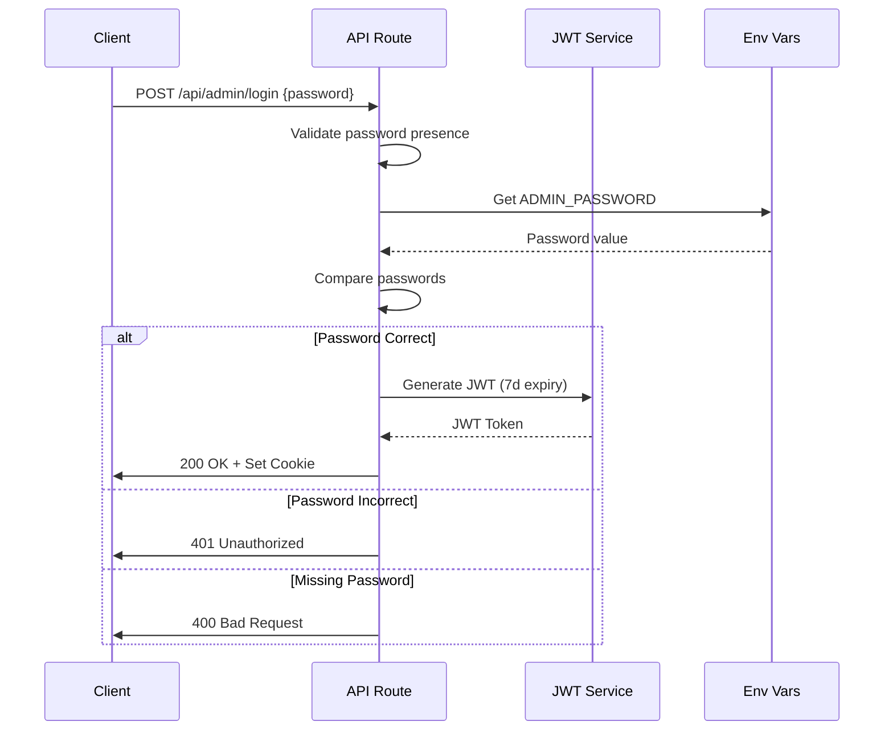
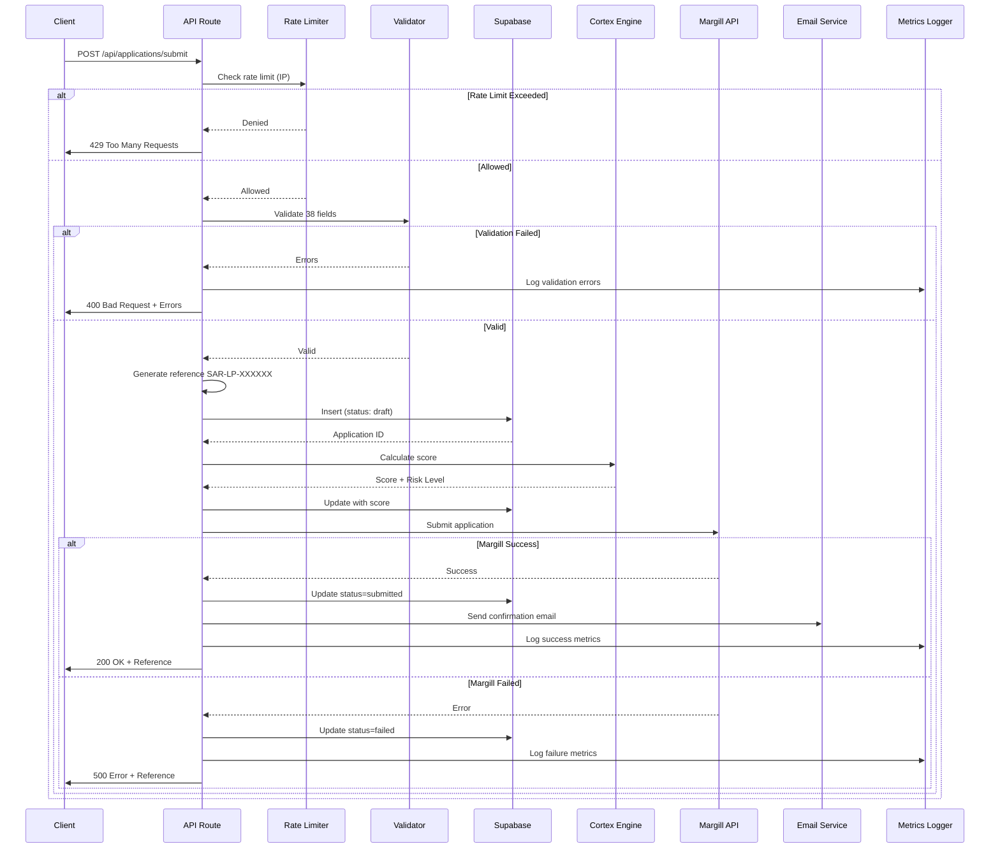
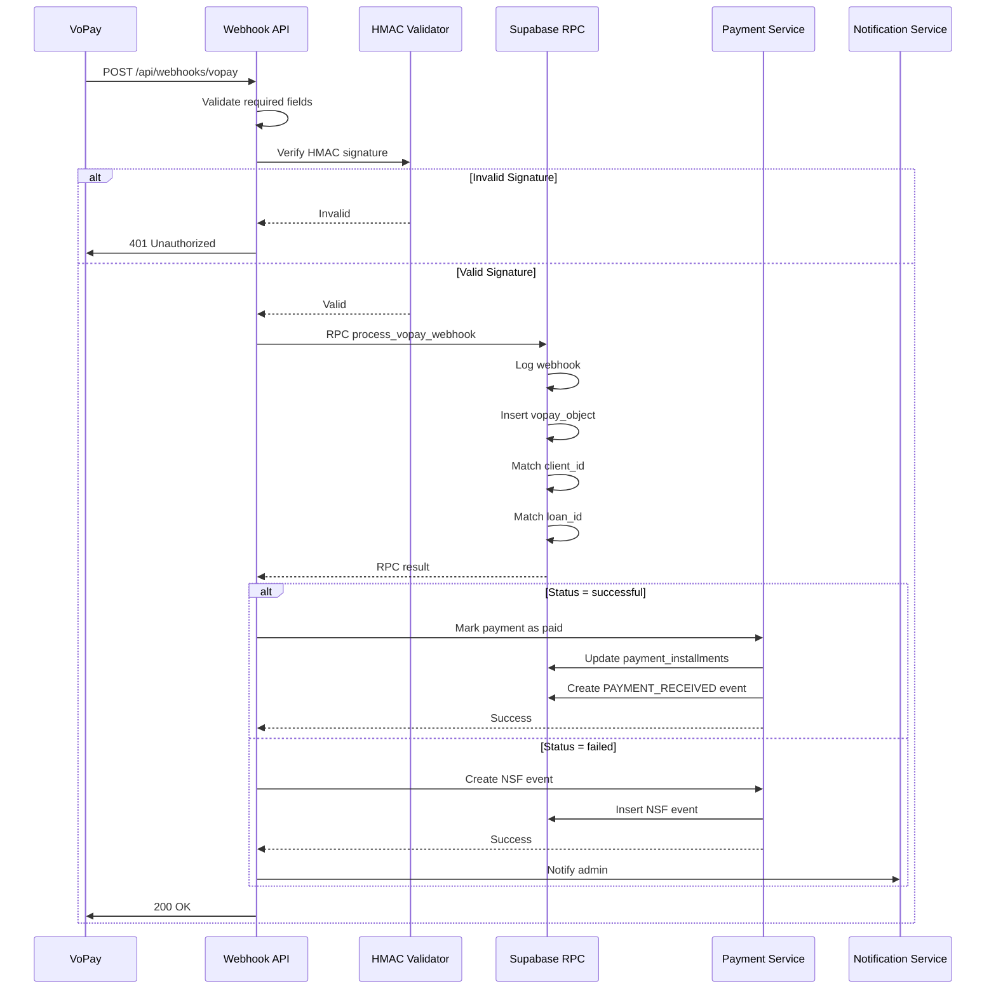
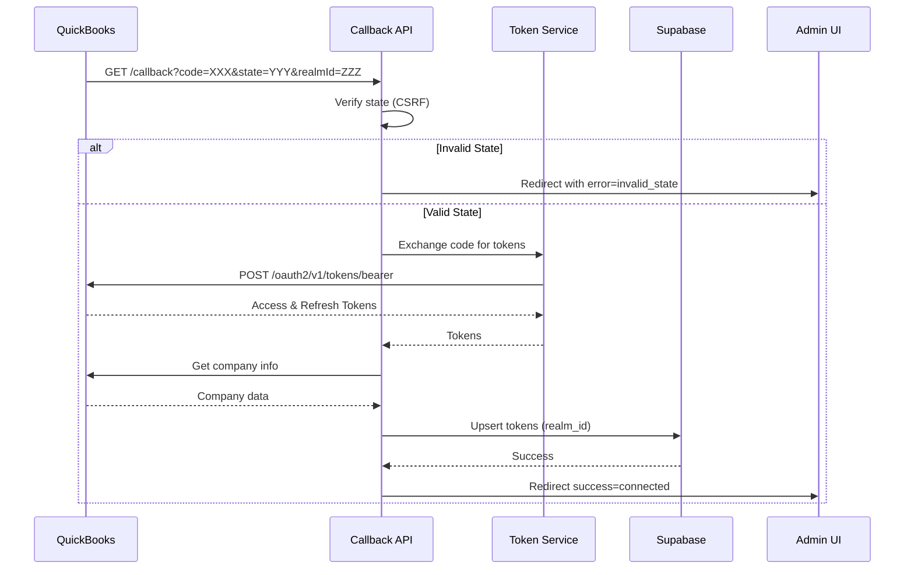
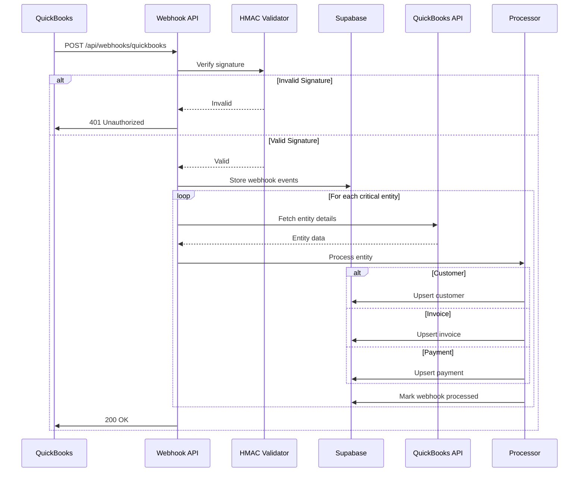

# REQUEST FLOW DIAGRAMS

Documentation complete des flux de requetes API pour Solution Argent Rapide.

## Table des Matieres

1. [Authentication](#1-authentication)
2. [Applications](#2-applications)
3. [Contact](#3-contact)
4. [VoPay](#4-vopay)
5. [QuickBooks](#5-quickbooks)
6. [Admin](#6-admin)
7. [Webhooks](#7-webhooks)

---

## 1. AUTHENTICATION

### POST /api/admin/login

**Authentication de l'administrateur avec JWT**

```
POST /api/admin/login
├─ Request Headers
│  ├─ Content-Type: application/json
│  └─ User-Agent: <browser>
├─ Request Body
│  └─ {
│       "password": "string" (required)
│     }
├─ Process Flow
│  ├─ 1. Validate password presence
│  ├─ 2. Compare with ADMIN_PASSWORD env var
│  ├─ 3. Generate JWT token (7 days expiry)
│  └─ 4. Set httpOnly cookie
├─ Response Success (200)
│  └─ {
│       "success": true
│     }
│  └─ Cookie: admin-session=<jwt_token>; HttpOnly; Secure; SameSite=Lax; Max-Age=604800
├─ Response Errors
│  ├─ 400 Bad Request: Missing password
│  │  └─ { "error": "Mot de passe requis" }
│  ├─ 401 Unauthorized: Wrong password
│  │  └─ { "error": "Mot de passe incorrect" }
│  └─ 500 Server Error
│     └─ { "error": "Erreur serveur" }
└─ Example cURL
   └─ curl -X POST https://solutionargentrapide.ca/api/admin/login \
        -H "Content-Type: application/json" \
        -d '{"password":"your_password"}' \
        -c cookies.txt
```

**Security:**
- JWT Secret: `process.env.JWT_SECRET`
- Token Expiry: 7 days
- Cookie: HttpOnly, Secure (production), SameSite=Lax
- Algorithm: HS256

**Sequence Diagram:**



---

### POST /api/admin/logout

**Deconnexion de l'administrateur**

```
POST /api/admin/logout
├─ Request Headers
│  ├─ Cookie: admin-session=<token>
│  └─ Content-Type: application/json
├─ Process Flow
│  └─ Delete admin-session cookie
├─ Response Success (200)
│  └─ { "success": true }
└─ Example cURL
   └─ curl -X POST https://solutionargentrapide.ca/api/admin/logout \
        -b cookies.txt
```

**Security:**
- No authentication required
- Cookie deletion is client-side
- Always returns success

---

## 2. APPLICATIONS

### POST /api/applications/submit

**Soumission d'une demande de pret (38 champs)**

```
POST /api/applications/submit
├─ Request Headers
│  ├─ Content-Type: application/json
│  ├─ User-Agent: <browser>
│  ├─ X-Forwarded-For: <client_ip>
│  └─ X-Real-IP: <client_ip>
├─ Request Body (LoanApplicationFormData)
│  └─ {
│       // Informations personnelles
│       "prenom": "string",
│       "nom": "string",
│       "courriel": "string",
│       "telephone": "string",
│       "date_naissance": "YYYY-MM-DD",
│
│       // Adresse
│       "adresse_rue": "string",
│       "adresse_ville": "string",
│       "adresse_province": "string",
│       "adresse_code_postal": "string",
│       "duree_residence_mois": number,
│       "type_logement": "proprietaire|locataire|autre",
│
│       // Montant et pret
│       "montant_demande": number,
│       "raison_pret": "string",
│       "duree_pret_mois": number,
│       "origin": "string",
│
│       // Emploi
│       "statut_emploi": "string",
│       "employeur": "string",
│       "poste": "string",
│       "revenu_annuel": number,
│       "anciennete_emploi_mois": number,
│       "frequence_paie": "string",
│       "prochaine_paie": "YYYY-MM-DD",
│
│       // Informations bancaires
│       "institution_financiere": "string",
│       "transit": "string",
│       "numero_compte": "string",
│       "type_compte": "cheque|epargne",
│
│       // Autres revenus
│       "autres_revenus": number,
│       "source_autres_revenus": "string",
│
│       // Dettes
│       "paiement_loyer_hypotheque": number,
│       "autres_prets": number,
│       "cartes_credit": number,
│       "autres_dettes": number,
│
│       // Co-emprunteur
│       "coemprunteur_prenom": "string",
│       "coemprunteur_nom": "string",
│       "coemprunteur_telephone": "string",
│       "coemprunteur_revenu": number,
│
│       // References
│       "reference_1_nom": "string",
│       "reference_1_telephone": "string",
│       "reference_1_relation": "string",
│       "reference_2_nom": "string",
│       "reference_2_telephone": "string",
│       "reference_2_relation": "string"
│     }
├─ Process Flow (10 etapes)
│  ├─ 1. Rate Limiting (3 per IP/hour)
│  ├─ 2. Validation complete (38 champs)
│  ├─ 3. Generate reference (SAR-LP-XXXXXX)
│  ├─ 4. Store in Supabase (status: draft)
│  ├─ 5. Execute Cortex scoring
│  ├─ 6. Submit to Margill API
│  ├─ 7. Update status (submitted/failed)
│  ├─ 8. Send confirmation email
│  ├─ 9. Log metrics
│  └─ 10. Return result
├─ Response Success (200)
│  └─ {
│       "success": true,
│       "data": {
│         "reference": "SAR-LP-XXXXXX",
│         "status": "submitted",
│         "cortex_score": number,
│         "message": "Votre demande a ete soumise avec succes!"
│       }
│     }
├─ Response Errors
│  ├─ 400 Bad Request: Validation failed
│  │  └─ {
│  │       "success": false,
│  │       "error": "Donnees invalides",
│  │       "errors": [
│  │         {
│  │           "field": "string",
│  │           "message": "string",
│  │           "code": "string"
│  │         }
│  │       ]
│  │     }
│  ├─ 429 Too Many Requests: Rate limit hit
│  │  └─ {
│  │       "success": false,
│  │       "error": "Trop de demandes. Veuillez reessayer plus tard.",
│  │       "resetAt": "ISO8601"
│  │     }
│  └─ 500 Server Error
│     └─ { "success": false, "error": "Erreur serveur" }
└─ Example cURL
   └─ curl -X POST https://solutionargentrapide.ca/api/applications/submit \
        -H "Content-Type: application/json" \
        -d @application.json
```

**Rate Limiting:**
- 3 submissions per IP per hour
- Tracked in-memory (will reset on server restart)
- Returns 429 with resetAt timestamp

**Validation Rules:**
- Email: RFC 5322 compliant
- Phone: Canadian format (10 digits)
- Postal Code: Canadian format (A1A 1A1)
- Amount: Between $500 and $35,000
- Income: Minimum $1,000/month
- Age: 18-75 years old

**Sequence Diagram:**



**Cortex Scoring:**
- Base score: 50
- Income >= $50,000: +20 points
- Homeowner: +15 points
- High debt ratio: -25 points
- Risk levels: low | medium | high

---

## 3. CONTACT

### POST /api/contact

**Formulaire de contact general**

```
POST /api/contact
├─ Request Headers
│  ├─ Content-Type: application/json
│  ├─ User-Agent: <browser>
│  ├─ X-Forwarded-For: <client_ip>
│  ├─ Referer: <page_url>
│  └─ Accept-Language: <language>
├─ Request Body
│  └─ {
│       "nom": "string" (optional),
│       "prenom": "string" (optional),
│       "contact": "string (email or phone)" (required),
│       "contactMethod": "email|phone" (required),
│       "telephone": "string" (optional),
│       "sujet": "string" (optional),
│       "message": "string (max 5000 chars)" (required),
│       "source": "site|nous-joindre" (default: "site"),
│       "clientMetadata": {
│         "timezone": "string",
│         "screenResolution": "string",
│         "utmSource": "string",
│         "utmMedium": "string",
│         "utmCampaign": "string"
│       }
│     }
├─ Process Flow
│  ├─ 1. Rate limiting (5 per IP/hour)
│  ├─ 2. Validate required fields
│  ├─ 3. Sanitize inputs (XSS prevention)
│  ├─ 4. Validate email/phone format
│  ├─ 5. Route to department (Sandra/Michel)
│  ├─ 6. Generate reference (SAR-XXXXXX)
│  ├─ 7. Store in Supabase
│  ├─ 8. Send email to team (Resend)
│  └─ 9. Send confirmation to client
├─ Response Success (200)
│  └─ {
│       "success": true,
│       "method": "resend+supabase",
│       "reference": "SAR-XXXXXX"
│     }
├─ Response Errors
│  ├─ 400 Bad Request: Missing/invalid fields
│  ├─ 429 Too Many Requests: Rate limit
│  └─ 500 Server Error
└─ Example cURL
   └─ curl -X POST https://solutionargentrapide.ca/api/contact \
        -H "Content-Type: application/json" \
        -d '{
          "contact": "client@example.com",
          "contactMethod": "email",
          "message": "Bonjour, j'\''ai une question..."
        }'
```

**Department Routing:**
- Source: `nous-joindre` → Sandra (Administration)
- Source: `site` → Michel (Analyse et suivi)
- Email: `perception@solutionargentrapide.ca` (Sandra)
- Email: `mrosa@solutionargentrapide.ca` (Michel)

**Rate Limiting:**
- 5 messages per IP per hour
- In-memory tracking

**Security:**
- HTML entity encoding for XSS prevention
- Email validation: RFC 5322
- Phone validation: Canadian format
- Message length: max 5000 characters

---

### POST /api/contact-analyse

**Formulaire de contact avec question predefinie**

```
POST /api/contact-analyse
├─ Request Headers
│  ├─ Content-Type: application/json
│  ├─ User-Agent: <browser>
│  ├─ X-Forwarded-For: <client_ip>
│  ├─ Referer: <page_url>
│  └─ Accept-Language: <language>
├─ Request Body
│  └─ {
│       "nom": "string (full name)" (required),
│       "email": "string (email)" (required),
│       "telephone": "string (phone)" (required),
│       "question": "string (predefined option)" (required),
│       "questionAutre": "string (if question=Autre)" (optional),
│       "source": "analyse|accueil|espace-client|analyse-suivi" (default: "analyse"),
│       "clientMetadata": {
│         "timezone": "string",
│         "screenResolution": "string",
│         "utmSource": "string",
│         "utmMedium": "string",
│         "utmCampaign": "string"
│       }
│     }
├─ Process Flow
│  ├─ 1. Validate required fields
│  ├─ 2. Determine department by source
│  ├─ 3. Route "Autre question" to Sandra
│  ├─ 4. Route predefined questions to Michel
│  ├─ 5. Generate reference (SAR-XXXXXX)
│  ├─ 6. Store in Supabase with metrics
│  ├─ 7. Auto-assign to responsible person
│  ├─ 8. Send email to team
│  └─ 9. Send confirmation to client
├─ Response Success (200)
│  └─ {
│       "success": true,
│       "method": "resend+supabase",
│       "reference": "SAR-XXXXXX",
│       "destinataire": "email@domain.com"
│     }
├─ Response Errors
│  ├─ 400 Bad Request: Missing fields
│  └─ 500 Server Error
└─ Example cURL
   └─ curl -X POST https://solutionargentrapide.ca/api/contact-analyse \
        -H "Content-Type: application/json" \
        -d '{
          "nom": "Jean Dupont",
          "email": "jean@example.com",
          "telephone": "514-555-1234",
          "question": "Statut de ma demande",
          "source": "accueil"
        }'
```

**Predefined Questions:**
- "Statut de ma demande"
- "Modifier mes informations"
- "Question sur mon paiement"
- "Probleme technique"
- "Autre question" (requires `questionAutre`)

**Auto-Assignment:**
- `espace-client` source → Sandra
- "Autre question" → Sandra
- All other questions → Michel

---

## 4. VOPAY

### POST /api/webhooks/vopay

**Webhook pour recevoir les notifications de transaction VoPay**

```
POST /api/webhooks/vopay
├─ Request Headers
│  ├─ Content-Type: application/json
│  └─ User-Agent: VoPay-Webhook/1.0
├─ Request Body (VoPayWebhookPayload)
│  └─ {
│       "Success": boolean,
│       "TransactionType": "eft|interac|wire",
│       "TransactionID": "string",
│       "TransactionAmount": "string (decimal)",
│       "Status": "pending|in progress|successful|failed|cancelled",
│       "UpdatedAt": "ISO8601",
│       "ValidationKey": "string (HMAC SHA1 signature)",
│       "FailureReason": "string" (optional),
│       "Environment": "Production|Sandbox"
│     }
├─ Process Flow
│  ├─ 1. Validate required fields
│  ├─ 2. Verify HMAC signature
│  ├─ 3. Call RPC process_vopay_webhook
│  ├─ 4. Match to client and loan
│  ├─ 5. Update payment status
│  ├─ 6. Create payment events
│  └─ 7. Return success to VoPay
├─ Response Success (200)
│  └─ {
│       "success": true,
│       "message": "Webhook processed",
│       "transactionId": "string",
│       "status": "string",
│       "logId": number
│     }
├─ Response Errors
│  ├─ 400 Bad Request: Missing fields
│  ├─ 401 Unauthorized: Invalid signature
│  └─ 500 Server Error: Database error
└─ Example cURL (VoPay sends this)
   └─ curl -X POST https://solutionargentrapide.ca/api/webhooks/vopay \
        -H "Content-Type: application/json" \
        -d '{
          "TransactionID": "TX-12345",
          "Status": "successful",
          "TransactionAmount": "250.00",
          "ValidationKey": "abc123...",
          ...
        }'
```

**Security:**
- HMAC SHA1 signature validation
- Shared Secret: `process.env.VOPAY_SHARED_SECRET`
- Signature = HMAC_SHA1(SharedSecret + TransactionID)
- Timing-safe comparison

**Status Handling:**
- `successful`: Mark payment as paid, create PAYMENT_RECEIVED event
- `failed`: Create NSF event, notify admin
- `pending`, `in progress`: No action
- `cancelled`: Mark as skipped

**Database Operations:**
- Atomic RPC: `process_vopay_webhook`
- Insert into `vopay_objects`
- Match client by transaction metadata
- Update `payment_installments` if matched
- Create `payment_events`

**Sequence Diagram:**



---

### GET /api/vopay/stats

**Statistiques globales VoPay**

```
GET /api/vopay/stats
├─ Request Headers
│  └─ Cookie: admin-session=<token> (required)
├─ Response Success (200)
│  └─ {
│       "stats": {
│         "total_transactions": number,
│         "successful_count": number,
│         "failed_count": number,
│         "success_rate": "string (percentage)",
│         "total_amount": number
│       },
│       "transactions": [
│         {
│           "id": number,
│           "vopay_id": "string",
│           "amount": number,
│           "status": "string",
│           "occurred_at": "ISO8601",
│           "client_id": number
│         }
│       ]
│     }
├─ Response Errors
│  └─ 500 Server Error
└─ Example cURL
   └─ curl https://solutionargentrapide.ca/api/vopay/stats \
        -b cookies.txt
```

---

### GET /api/vopay/stats/[clientId]

**Statistiques VoPay pour un client specifique**

```
GET /api/vopay/stats/[clientId]
├─ Path Parameters
│  └─ clientId: number (Supabase client ID)
├─ Request Headers
│  └─ Cookie: admin-session=<token> (required)
├─ Response Success (200)
│  └─ {
│       "stats": {
│         "total_transactions": number,
│         "successful_count": number,
│         "failed_count": number,
│         "success_rate": "string",
│         "total_amount": number
│       },
│       "transactions": [
│         {
│           "id": number,
│           "vopay_id": "string",
│           "amount": number,
│           "status": "string",
│           "occurred_at": "ISO8601",
│           "object_type": "string"
│         }
│       ]
│     }
├─ Response Errors
│  └─ 500 Server Error
└─ Example cURL
   └─ curl https://solutionargentrapide.ca/api/vopay/stats/123 \
        -b cookies.txt
```

---

## 5. QUICKBOOKS

### GET /api/quickbooks/auth/connect

**Initiate QuickBooks OAuth 2.0 flow**

```
GET /api/quickbooks/auth/connect
├─ Response Success (200)
│  └─ {
│       "authUrl": "https://appcenter.intuit.com/connect/oauth2?..."
│     }
│  └─ Cookie: qb_oauth_state=<uuid>; HttpOnly; SameSite=Lax; Max-Age=600
├─ Response Errors
│  └─ 500 Server Error: Missing INTUIT_CLIENT_ID
└─ Example cURL
   └─ curl https://solutionargentrapide.ca/api/quickbooks/auth/connect \
        -c cookies.txt
```

**OAuth Parameters:**
- `client_id`: INTUIT_CLIENT_ID
- `scope`: "com.intuit.quickbooks.accounting openid profile email"
- `redirect_uri`: `/api/quickbooks/auth/callback`
- `response_type`: "code"
- `state`: Random UUID for CSRF protection

---

### GET /api/quickbooks/auth/callback

**QuickBooks OAuth 2.0 Callback (automatic)**

```
GET /api/quickbooks/auth/callback?code=XXX&state=YYY&realmId=ZZZ
├─ Query Parameters
│  ├─ code: string (authorization code)
│  ├─ state: string (CSRF token)
│  ├─ realmId: string (QuickBooks company ID)
│  └─ error: string (optional, if error)
├─ Process Flow
│  ├─ 1. Verify state parameter (CSRF)
│  ├─ 2. Exchange code for tokens
│  ├─ 3. Fetch company info
│  ├─ 4. Store tokens in database
│  └─ 5. Redirect to admin page
├─ Redirect Success
│  └─ /admin/quickbooks?success=connected
├─ Redirect Errors
│  ├─ ?error=invalid_state (CSRF failed)
│  ├─ ?error=token_exchange_failed
│  └─ ?error=db_error
└─ Token Storage
   └─ Table: quickbooks_tokens
       ├─ realm_id (unique)
       ├─ company_name
       ├─ access_token
       ├─ refresh_token
       ├─ expires_at
       └─ refresh_token_expires_at
```

**Token Exchange:**
- Endpoint: `https://oauth.platform.intuit.com/oauth2/v1/tokens/bearer`
- Method: POST
- Auth: Basic `Base64(client_id:client_secret)`
- Body: `grant_type=authorization_code&code=XXX&redirect_uri=...`

**Sequence Diagram:**



---

### POST /api/quickbooks/sync/customers

**Sync customers from QuickBooks to local database**

```
POST /api/quickbooks/sync/customers
├─ Request Headers
│  └─ Cookie: admin-session=<token> (required)
├─ Process Flow
│  ├─ 1. Get QuickBooks token from DB
│  ├─ 2. Check token expiry
│  ├─ 3. Fetch customers (max 1000)
│  ├─ 4. Upsert each customer
│  └─ 5. Return count
├─ Response Success (200)
│  └─ {
│       "success": true,
│       "count": number,
│       "message": "Synced X customers"
│     }
├─ Response Errors
│  ├─ 401 Unauthorized: Not connected or token expired
│  └─ 500 Server Error
└─ Example cURL
   └─ curl -X POST https://solutionargentrapide.ca/api/quickbooks/sync/customers \
        -b cookies.txt
```

**QuickBooks Query:**
- Endpoint: `/v3/company/{realmId}/query`
- Query: `SELECT * FROM Customer MAXRESULTS 1000`
- Max results: 1000 per request

**Database Storage:**
- Table: `quickbooks_customers`
- Unique key: `qb_id`
- Operation: Upsert (insert or update)

---

### POST /api/quickbooks/sync/all

**Full sync - syncs all data from QuickBooks**

```
POST /api/quickbooks/sync/all
├─ Request Headers
│  └─ Cookie: admin-session=<token> (required)
├─ Process Flow
│  ├─ 1. Sync customers
│  ├─ 2. Sync invoices
│  ├─ 3. Sync payments
│  ├─ 4. Sync accounts
│  └─ 5. Sync vendors
├─ Response Success (200)
│  └─ {
│       "success": true,
│       "results": {
│         "customers": { "success": true, "count": number, "error": null },
│         "invoices": { "success": true, "count": number, "error": null },
│         "payments": { "success": true, "count": number, "error": null },
│         "accounts": { "success": true, "count": number, "error": null },
│         "vendors": { "success": true, "count": number, "error": null }
│       },
│       "totalCount": number,
│       "successCount": number,
│       "message": "Synced X total records (Y/5 categories successful)"
│     }
├─ Response Errors
│  └─ 500 Server Error
└─ Example cURL
   └─ curl -X POST https://solutionargentrapide.ca/api/quickbooks/sync/all \
        -b cookies.txt
```

**Sync Strategy:**
- Sequential sync (one after another)
- Independent error handling (one failure doesn't stop others)
- Returns partial success

---

### GET /api/quickbooks/reports/profit-loss

**Get Profit & Loss report from QuickBooks (real-time)**

```
GET /api/quickbooks/reports/profit-loss?start_date=2024-01-01&end_date=2024-12-31&accounting_method=Accrual
├─ Query Parameters
│  ├─ start_date: YYYY-MM-DD (default: first day of year)
│  ├─ end_date: YYYY-MM-DD (default: today)
│  └─ accounting_method: Cash|Accrual (default: Accrual)
├─ Request Headers
│  └─ Cookie: admin-session=<token> (required)
├─ Response Success (200)
│  └─ {
│       "success": true,
│       "report": { /* QuickBooks report data */ },
│       "parameters": {
│         "start_date": "YYYY-MM-DD",
│         "end_date": "YYYY-MM-DD",
│         "accounting_method": "Accrual",
│         "company_name": "string",
│         "realm_id": "string"
│       },
│       "fetched_at": "ISO8601"
│     }
├─ Response Errors
│  ├─ 401 Unauthorized: Not connected or token expired
│  └─ 500 Server Error
└─ Example cURL
   └─ curl "https://solutionargentrapide.ca/api/quickbooks/reports/profit-loss?start_date=2024-01-01&end_date=2024-12-31" \
        -b cookies.txt
```

**QuickBooks Report API:**
- Endpoint: `/v3/company/{realmId}/reports/ProfitAndLoss`
- Real-time fetch (not cached)
- Parameters passed as query string

---

## 6. ADMIN

### GET /api/admin/messages

**Recuperer tous les messages de contact**

```
GET /api/admin/messages?status=nouveau&limit=100
├─ Query Parameters
│  ├─ messageId: number (optional, for single message with emails/notes)
│  ├─ status: string (optional filter)
│  └─ limit: number (default: 100)
├─ Request Headers
│  └─ Cookie: admin-session=<token> (required)
├─ Response Success (200) - All messages
│  └─ {
│       "messages": [
│         {
│           "id": "string",
│           "nom": "string",
│           "email": "string",
│           "telephone": "string",
│           "question": "string",
│           "date": "ISO8601",
│           "lu": boolean,
│           "status": "nouveau|en_cours|resolu",
│           "reference": "SAR-XXXXXX",
│           "assigned_to": "Sandra|Michel|null",
│           "assigned_at": "ISO8601",
│           "assigned_by": "string",
│           "system_responded": boolean,
│           "email_count": number,
│           "note_count": number
│         }
│       ],
│       "total": number,
│       "nonLus": number
│     }
├─ Response Success (200) - Single message with emails/notes
│  └─ {
│       "emails": [
│         {
│           "id": "string",
│           "messageId": "string",
│           "type": "system|manual",
│           "to": "string",
│           "subject": "string",
│           "content": "string",
│           "sentBy": "string",
│           "date": "ISO8601"
│         }
│       ],
│       "notes": [
│         {
│           "id": "string",
│           "messageId": "string",
│           "from": "string",
│           "to": "string",
│           "content": "string",
│           "date": "ISO8601"
│         }
│       ]
│     }
├─ Response Errors
│  ├─ 401 Unauthorized: Missing/invalid session
│  └─ 500 Server Error
└─ Example cURL
   └─ curl "https://solutionargentrapide.ca/api/admin/messages?status=nouveau" \
        -b cookies.txt
```

**Filters:**
- `status`: Filter by message status
- `limit`: Limit number of results
- `messageId`: Get specific message with relations

---

### POST /api/admin/messages/assign

**Assigner un message a un collegue**

```
POST /api/admin/messages/assign
├─ Request Headers
│  ├─ Cookie: admin-session=<token> (required)
│  └─ Content-Type: application/json
├─ Request Body
│  └─ {
│       "messageId": number (required),
│       "assignTo": "Sandra|Michel|Unassigned" (required)
│     }
├─ Process Flow
│  ├─ 1. Verify authentication
│  ├─ 2. Validate assignTo value
│  ├─ 3. Update message assignment
│  └─ 4. Create internal note
├─ Response Success (200)
│  └─ {
│       "success": true,
│       "message": "Message assigne a X"
│     }
├─ Response Errors
│  ├─ 400 Bad Request: Invalid assignTo
│  ├─ 401 Unauthorized: Not authenticated
│  └─ 500 Server Error
└─ Example cURL
   └─ curl -X POST https://solutionargentrapide.ca/api/admin/messages/assign \
        -H "Content-Type: application/json" \
        -b cookies.txt \
        -d '{"messageId": 123, "assignTo": "Sandra"}'
```

**Valid Colleagues:**
- "Sandra" (Administration/Comptabilite)
- "Michel" (Analyse et suivi)
- "Unassigned" (Desassigner)

**Internal Note:**
- Created in `notes_internes` table
- Tracks who assigned to whom
- Timestamp of assignment

---

### GET /api/admin/messages/assign (stats)

**Recuperer les statistiques d'assignation**

```
GET /api/admin/messages/assign
├─ Request Headers
│  └─ Cookie: admin-session=<token> (required)
├─ Response Success (200)
│  └─ {
│       "success": true,
│       "stats": {
│         // Totaux du mois
│         "totalDuMois": number,
│
│         // Reponses
│         "reponsesEnvoyees": number,
│         "reponsesNonEnvoyees": number,
│
│         // Acheminements
│         "acheminesSandra": number,
│         "acheminesMichel": number,
│         "nonAchemines": number,
│
│         // Dates des derniers messages
│         "lastAll": "ISO8601",
│         "lastReponse": "ISO8601",
│         "lastSandra": "ISO8601",
│         "lastMichel": "ISO8601",
│         "lastNone": "ISO8601",
│
│         // Par collegue
│         "byColleague": {
│           "Sandra": number,
│           "Michel": number
│         }
│       }
│     }
├─ Response Errors
│  ├─ 401 Unauthorized
│  └─ 500 Server Error
└─ Example cURL
   └─ curl https://solutionargentrapide.ca/api/admin/messages/assign \
        -b cookies.txt
```

**Time Range:**
- Stats calculated for current month only
- From first day of month to now

---

## 7. WEBHOOKS

### POST /api/webhooks/quickbooks

**QuickBooks real-time event notifications**

```
POST /api/webhooks/quickbooks
├─ Request Headers
│  ├─ Content-Type: application/json
│  └─ Intuit-Signature: <signature>
├─ Request Body
│  └─ {
│       "eventNotifications": [
│         {
│           "realmId": "string",
│           "dataChangeEvent": {
│             "entities": [
│               {
│                 "name": "Customer|Invoice|Payment|Account|Vendor",
│                 "id": "string",
│                 "operation": "Create|Update|Delete|Merge",
│                 "lastUpdated": "ISO8601"
│               }
│             ]
│           }
│         }
│       ]
│     }
├─ Process Flow
│  ├─ 1. Verify HMAC signature
│  ├─ 2. Store webhook events
│  ├─ 3. Process critical entities immediately
│  ├─ 4. Fetch entity from QuickBooks API
│  ├─ 5. Upsert in local database
│  └─ 6. Mark webhook as processed
├─ Response Success (200)
│  └─ {
│       "success": true,
│       "message": "Webhook processed successfully"
│     }
├─ Response Errors
│  ├─ 401 Unauthorized: Missing/invalid signature
│  └─ 500 Server Error
└─ Security
   └─ HMAC SHA-256 signature validation
       ├─ Token: INTUIT_WEBHOOK_TOKEN
       └─ Hash = HMAC_SHA256(token, payload)
```

**Entity Handling:**
- Critical entities (immediate sync):
  - Customer
  - Invoice
  - Payment
- Operations:
  - Create: Insert new record
  - Update: Update existing record
  - Delete: Soft delete or remove
  - Merge: Merge two records

**Sequence Diagram:**



**Database Tables:**
- `quickbooks_webhooks`: Log all webhook events
- `quickbooks_customers`: Customer data
- `quickbooks_invoices`: Invoice data
- `quickbooks_payments`: Payment data
- `quickbooks_accounts`: Account data
- `quickbooks_vendors`: Vendor data

---

## GLOBAL CONFIGURATION

### Environment Variables

```bash
# Database
NEXT_PUBLIC_SUPABASE_URL=https://xxx.supabase.co
SUPABASE_SERVICE_KEY=xxx
SUPABASE_SERVICE_ROLE_KEY=xxx

# Authentication
ADMIN_PASSWORD=xxx
JWT_SECRET=xxx

# Email
RESEND_API_KEY=xxx

# VoPay
VOPAY_SHARED_SECRET=xxx
VOPAY_API_KEY=xxx
VOPAY_ACCOUNT_ID=xxx

# QuickBooks
INTUIT_CLIENT_ID=xxx
INTUIT_CLIENT_SECRET=xxx
INTUIT_WEBHOOK_TOKEN=xxx
INTUIT_ENVIRONMENT=sandbox|production

# Margill
MARGILL_API_KEY=xxx
MARGILL_API_URL=xxx

# App
NEXT_PUBLIC_APP_URL=https://solutionargentrapide.ca
NODE_ENV=development|production
```

### Rate Limiting

| Endpoint | Limit | Window | Storage |
|----------|-------|--------|---------|
| /api/applications/submit | 3 requests | 1 hour | In-memory |
| /api/contact | 5 requests | 1 hour | In-memory |
| /api/contact-analyse | No limit | - | - |

**Note:** In-memory rate limiting resets on server restart. Consider Redis for production.

### CORS Configuration

```javascript
// Applied globally via middleware
Access-Control-Allow-Origin: https://solutionargentrapide.ca
Access-Control-Allow-Methods: GET, POST, PUT, PATCH, DELETE, OPTIONS
Access-Control-Allow-Headers: Content-Type, Authorization, X-Requested-With
Access-Control-Allow-Credentials: true
```

### Error Handling

**Standard Error Response:**

```json
{
  "error": "string (user-friendly message)",
  "message": "string (technical details, optional)",
  "code": "string (error code, optional)",
  "details": "object (additional info, optional)"
}
```

**HTTP Status Codes:**

| Code | Meaning | Usage |
|------|---------|-------|
| 200 | OK | Success |
| 201 | Created | Resource created |
| 400 | Bad Request | Invalid input |
| 401 | Unauthorized | Missing/invalid auth |
| 403 | Forbidden | Insufficient permissions |
| 404 | Not Found | Resource not found |
| 429 | Too Many Requests | Rate limit exceeded |
| 500 | Server Error | Internal error |

---

## API TESTING

### Authentication Flow

```bash
# 1. Login
curl -X POST https://solutionargentrapide.ca/api/admin/login \
  -H "Content-Type: application/json" \
  -d '{"password":"your_password"}' \
  -c cookies.txt

# 2. Use authenticated endpoint
curl https://solutionargentrapide.ca/api/admin/messages \
  -b cookies.txt

# 3. Logout
curl -X POST https://solutionargentrapide.ca/api/admin/logout \
  -b cookies.txt
```

### Application Submission

```bash
curl -X POST https://solutionargentrapide.ca/api/applications/submit \
  -H "Content-Type: application/json" \
  -d '{
    "prenom": "Jean",
    "nom": "Dupont",
    "courriel": "jean@example.com",
    "telephone": "514-555-1234",
    "date_naissance": "1990-01-01",
    "adresse_rue": "123 Rue Principale",
    "adresse_ville": "Montreal",
    "adresse_province": "QC",
    "adresse_code_postal": "H1A 1A1",
    "duree_residence_mois": 24,
    "type_logement": "locataire",
    "montant_demande": 5000,
    "raison_pret": "Consolidation de dettes",
    "duree_pret_mois": 12,
    "statut_emploi": "Employe",
    "employeur": "ABC Inc",
    "poste": "Developpeur",
    "revenu_annuel": 60000,
    "anciennete_emploi_mois": 36,
    "frequence_paie": "Bi-mensuel",
    "prochaine_paie": "2024-01-15",
    "institution_financiere": "TD",
    "transit": "12345",
    "numero_compte": "1234567",
    "type_compte": "cheque",
    "autres_revenus": 0,
    "source_autres_revenus": "",
    "paiement_loyer_hypotheque": 1200,
    "autres_prets": 0,
    "cartes_credit": 500,
    "autres_dettes": 0,
    "origin": "formulaire"
  }'
```

### Contact Form

```bash
curl -X POST https://solutionargentrapide.ca/api/contact \
  -H "Content-Type: application/json" \
  -d '{
    "contact": "client@example.com",
    "contactMethod": "email",
    "message": "Bonjour, j'\''ai une question sur mon dossier.",
    "source": "site"
  }'
```

### VoPay Webhook (Test)

```bash
# Generate signature (HMAC SHA1)
TRANSACTION_ID="TX-12345"
SHARED_SECRET="your_shared_secret"
SIGNATURE=$(echo -n "$TRANSACTION_ID" | openssl dgst -sha1 -hmac "$SHARED_SECRET" | cut -d' ' -f2)

curl -X POST https://solutionargentrapide.ca/api/webhooks/vopay \
  -H "Content-Type: application/json" \
  -d "{
    \"Success\": true,
    \"TransactionType\": \"eft\",
    \"TransactionID\": \"$TRANSACTION_ID\",
    \"TransactionAmount\": \"250.00\",
    \"Status\": \"successful\",
    \"UpdatedAt\": \"$(date -u +%Y-%m-%dT%H:%M:%SZ)\",
    \"ValidationKey\": \"$SIGNATURE\",
    \"Environment\": \"Sandbox\"
  }"
```

### QuickBooks Sync

```bash
# Full sync
curl -X POST https://solutionargentrapide.ca/api/quickbooks/sync/all \
  -b cookies.txt

# Get profit & loss report
curl "https://solutionargentrapide.ca/api/quickbooks/reports/profit-loss?start_date=2024-01-01&end_date=2024-12-31" \
  -b cookies.txt
```

---

## MONITORING & DEBUGGING

### Health Checks

```bash
# VoPay webhook health
curl https://solutionargentrapide.ca/api/webhooks/vopay

# Response:
{
  "status": "online",
  "endpoint": "VoPay Webhook Receiver",
  "methods": ["POST"],
  "timestamp": "2024-01-20T10:00:00Z"
}
```

### Logging

All API routes use centralized logging:

- Request ID tracking
- Performance metrics (via `withPerf` wrapper)
- Error stack traces
- User actions (audit log)

### Performance Metrics

```javascript
// Wrapped endpoints track:
- Response time (ms)
- Database query count
- Cache hits/misses
- Error rate
- Throughput (req/sec)
```

---

## CHANGELOG

### Version 1.0 (Current)

- Initial API documentation
- Authentication endpoints
- Application submission flow
- Contact forms
- VoPay webhook integration
- QuickBooks OAuth & sync
- Admin message management

### Future Enhancements

- [ ] GraphQL API layer
- [ ] WebSocket support for real-time updates
- [ ] API versioning (/api/v2/...)
- [ ] Redis-based rate limiting
- [ ] OpenAPI/Swagger documentation
- [ ] API key authentication for third-party integrations

---

**Document generated:** 2024-01-22
**API Base URL:** https://solutionargentrapide.ca/api
**Documentation:** /REQUEST-FLOW-DIAGRAMS.md
