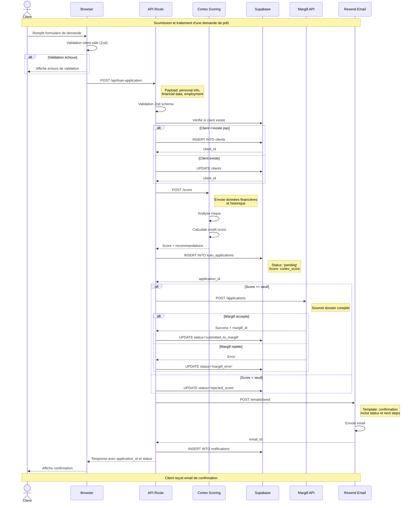
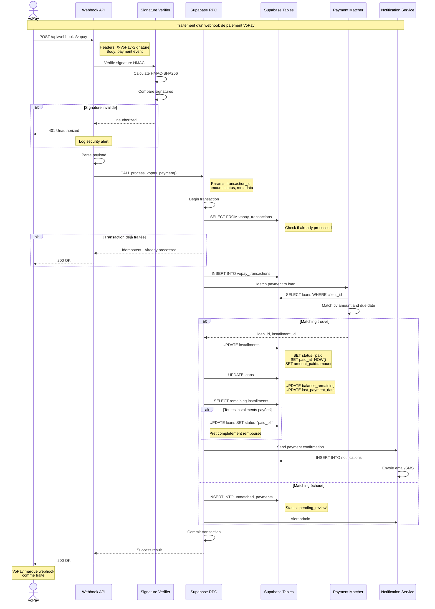
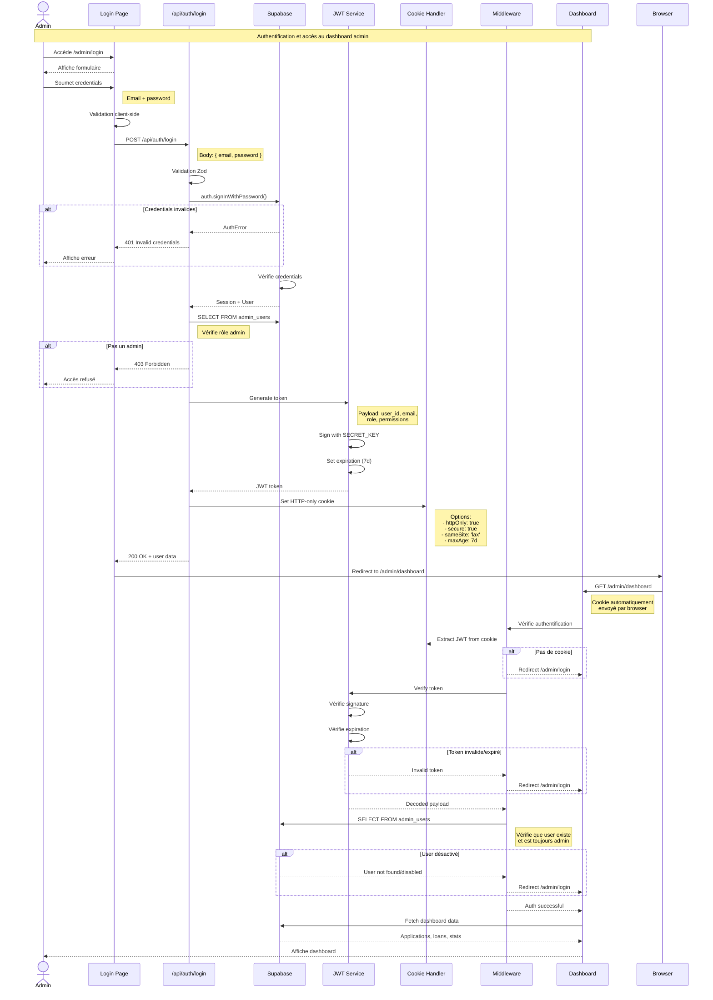
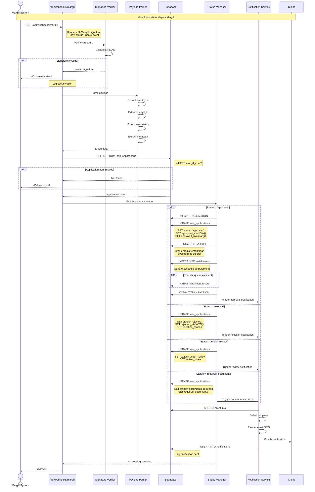
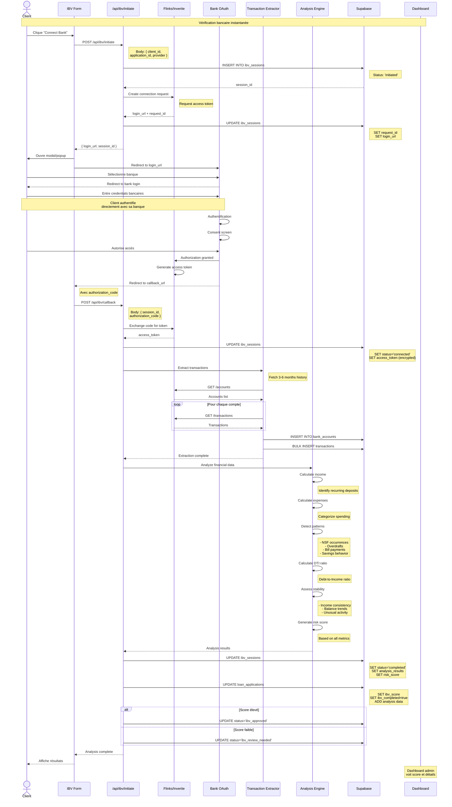
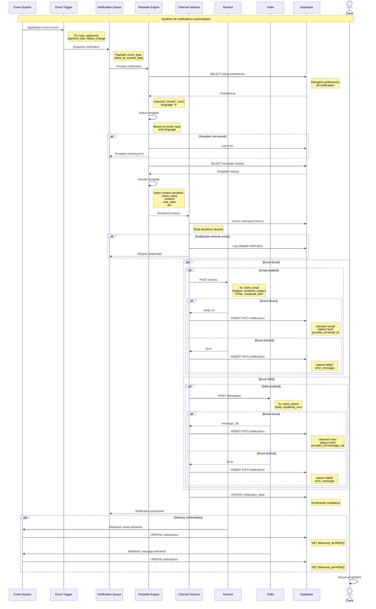
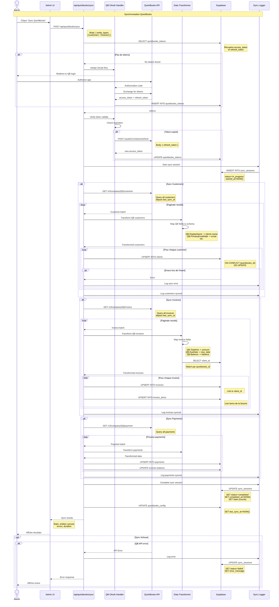

# SEQUENCE DIAGRAMS

Diagrammes de séquence UML formels pour tous les processus principaux de l'application SAR.

---

## 1. Processus Complet Demande de Prêt

---

## 2. Processus de Paiement VoPay

---

## 3. Processus d'Authentification Admin

---

## 4. Webhook Margill

---

## 5. IBV (Instant Bank Verification)

---

## 6. Notifications Automatiques

---

## 7. QuickBooks Sync

---

## 8. Fraud Detection Flow

```mermaid
sequenceDiagram
    participant App as Loan Application
    participant Detector as Fraud Detector
    participant Rules as Rules Engine
    participant Pattern as Pattern Matcher
    participant Scoring as Fraud Scoring
    participant ML as ML Model
    participant DB as Supabase
    participant Alert as Alert System
    participant Admin

    Note over App,Admin: Détection de fraude lors d'une application

    App->>Detector: Nouvelle application reçue
    Note right of Detector: Trigger: new application<br/>ou status change

    Detector->>DB: Fetch application data
    DB-->>Detector: Complete application

    Detector->>DB: Fetch client history
    Note right of DB: Applications précédentes,<br/>paiements, interactions
    DB-->>Detector: Client history

    Detector->>Rules: Evaluate rules

    par Rule Checks
        Rules->>Rules: Check duplicate detection
        Note right of Rules: - Même IP récente<br/>- Même device fingerprint<br/>- Email/phone similaire

        Rules->>DB: Query similar applications
        DB-->>Rules: Matching records

        alt Doublons trouvés
            Rules->>Rules: Flag: DUPLICATE_APPLICATION
        end
    and
        Rules->>Rules: Check velocity rules
        Note right of Rules: - Nb applications/jour<br/>- Nb applications/IP

        Rules->>DB: COUNT applications
        DB-->>Rules: Count

        alt Velocity dépassée
            Rules->>Rules: Flag: HIGH_VELOCITY
        end
    and
        Rules->>Rules: Check identity validation
        Note right of Rules: - SIN format<br/>- Address validation<br/>- Phone validation

        alt Données invalides
            Rules->>Rules: Flag: INVALID_IDENTITY
        end
    and
        Rules->>Rules: Check blacklist
        Note right of Rules: - Email blacklist<br/>- IP blacklist<br/>- Device blacklist

        Rules->>DB: SELECT FROM blacklist
        DB-->>Rules: Blacklist status

        alt Dans blacklist
            Rules->>Rules: Flag: BLACKLISTED
        end
    end

    Rules-->>Detector: Rule results + flags

    Detector->>Pattern: Analyze patterns

    Pattern->>Pattern: Income pattern analysis
    Note right of Pattern: - Income trop rond<br/>- Income incohérent<br/>avec profession

    Pattern->>Pattern: Document pattern analysis
    Note right of Pattern: - Documents modifiés<br/>- Metadata suspects

    Pattern->>Pattern: Behavior pattern analysis
    Note right of Pattern: - Form completion time<br/>- Copy/paste patterns<br/>- Bot-like behavior

    Pattern->>DB: Compare avec known fraud patterns
    DB-->>Pattern: Pattern matches

    alt Patterns suspects trouvés
        Pattern->>Pattern: Flag patterns
    end

    Pattern-->>Detector: Pattern analysis results

    Detector->>Scoring: Calculate fraud score

    Scoring->>Scoring: Calcul score basé sur règles
    Note right of Scoring: Poids par type de flag:<br/>- Blacklist: 50pts<br/>- Duplicate: 30pts<br/>- Pattern: 20pts<br/>etc.

    Scoring->>ML: Request ML prediction
    Note right of ML: Features: application data,<br/>rules results, patterns

    ML->>ML: Load trained model
    ML->>ML: Predict fraud probability
    ML-->>Scoring: Fraud probability (0-1)

    Scoring->>Scoring: Combine rule + ML scores
    Note right of Scoring: Weighted average:<br/>60% rules, 40% ML

    Scoring->>Scoring: Calculate final score (0-100)

    Scoring-->>Detector: Final fraud score

    Detector->>DB: INSERT INTO fraud_checks
    Note right of DB: Enregistre:<br/>- score<br/>- flags<br/>- patterns<br/>- timestamp

    alt Score >= HIGH_RISK (80+)
        Detector->>DB: UPDATE application
        Note right of DB: SET fraud_status='high_risk'<br/>SET auto_reject=true

        Detector->>DB: INSERT INTO fraud_cases
        Note right of DB: Crée case pour investigation

        Detector->>Alert: Send high risk alert
        Alert->>Alert: Format alert message
        Alert->>Admin: Email + Slack notification
        Note right of Admin: URGENT: High risk<br/>application detected

        Alert->>DB: INSERT INTO alerts

    else Score >= MEDIUM_RISK (50-79)
        Detector->>DB: UPDATE application
        Note right of DB: SET fraud_status='medium_risk'<br/>SET requires_review=true

        Detector->>Alert: Send review alert
        Alert->>Admin: Email notification
        Note right of Admin: Review required

    else Score < MEDIUM_RISK (< 50)
        Detector->>DB: UPDATE application
        Note right of DB: SET fraud_status='low_risk'<br/>SET fraud_check_passed=true

        Note over Detector: Application continue<br/>le flow normal
    end

    Detector->>DB: Log fraud check
    Note right of DB: INSERT INTO audit_log

    Detector-->>App: Fraud check complete

    opt Admin reviews case
        Admin->>DB: SELECT FROM fraud_cases
        Admin->>Admin: Investigate
        Admin->>DB: UPDATE fraud_cases
        Note right of DB: Decision: approve/reject<br/>Notes: investigation findings

        alt Faux positif
            Admin->>DB: UPDATE application
            Note right of DB: SET fraud_status='false_positive'<br/>SET approved_override=true
        else Fraude confirmée
            Admin->>DB: UPDATE application
            Note right of DB: SET fraud_status='confirmed_fraud'<br/>SET rejected=true

            Admin->>DB: INSERT INTO blacklist
            Note right of DB: Ajoute email, phone, IP
        end
    end
```

---

## Notes Techniques

### Gestion des Erreurs

Tous les diagrammes incluent des paths alternatifs (`alt`) pour gérer:
- Validation failures
- Authentication errors
- API timeouts
- Database errors
- External service failures

### Transactions

Les opérations critiques utilisent des transactions DB:
- Création de loan + installments
- Processing de paiements
- Updates de statuts avec side effects

### Sécurité

Points de sécurité illustrés:
- Signature verification pour tous les webhooks
- JWT validation dans authentication flow
- Token encryption pour données sensibles
- Rate limiting implicite dans fraud detection

### Idempotence

Webhooks VoPay et Margill implémentent l'idempotence:
- Check si transaction déjà traitée
- Return 200 si duplicate
- Évite double-processing

### Asynchrone

Certains processus sont asynchrones:
- Notifications (queue-based)
- Fraud detection (peut être background)
- QuickBooks sync (long-running)

### Logging et Audit

Tous les flows critiques incluent:
- Logging dans audit_log
- Tracking de statuts
- Error recording

---

## Légende

### Acteurs
- `actor`: Utilisateur humain (Client, Admin)
- `participant`: Système ou composant

### Flèches
- `->`: Appel synchrone
- `-->>`: Réponse
- `->>`: Message

### Blocs
- `alt/else/end`: Conditions
- `opt/end`: Optionnel
- `loop/end`: Boucle
- `par/and/end`: Parallèle
- `Note`: Commentaires explicatifs

---

**Document créé le**: 2026-01-22
**Version**: 1.0
**Projet**: SAR - Système d'Applications de Remboursement
