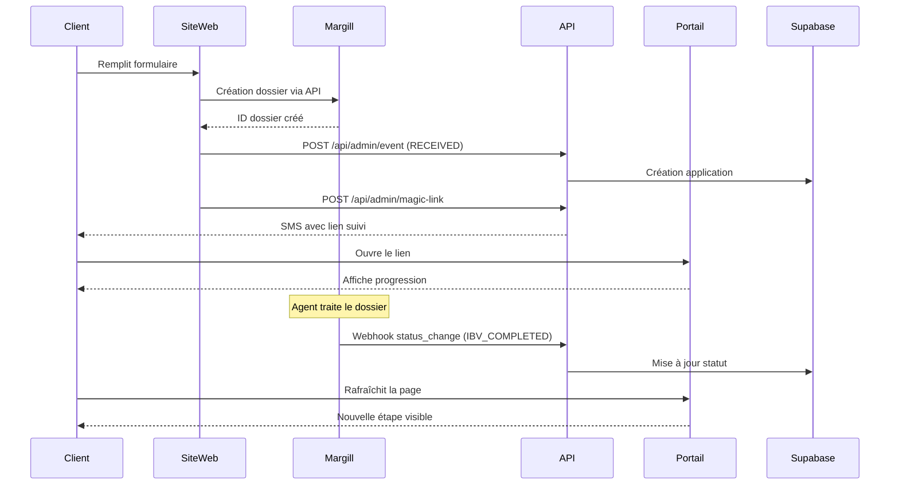

t# 🔗 Intégration Margill → Portail Progression

## Vue d'ensemble

Ce document explique comment configurer Margill pour synchroniser automatiquement les statuts des dossiers vers le portail de progression client.

---

## 🎯 Méthodes d'intégration disponibles

### Option 1: Webhooks Margill (Recommandé)
Si Margill supporte les webhooks, configure-les pour envoyer des notifications à notre API.

### Option 2: API Polling (Alternative)
Si pas de webhooks, on peut interroger l'API Margill régulièrement via un cron job.

### Option 3: Export automatique (Manuel)
Export de fichiers CSV/JSON que notre système traite automatiquement.

---

## 🔐 Endpoint API pour Margill

### URL du webhook:
```
POST https://progression.solutionargentrapide.ca/api/admin/event
```

### Headers requis:
```
Content-Type: application/json
x-api-key: FredRosa%1978
```

### Format du payload:
```json
{
  "application_id": "ID_DOSSIER_MARGILL",
  "event_type": "status_change",
  "status": "RECEIVED|IBV_COMPLETED|ANALYSIS_IN_PROGRESS|OFFER_SENT|APPROVED_BY_CLIENT|AWAITING_SIGNATURE|SIGNED|ACTIVE",
  "payload": {
    "name": "Nom du client",
    "email": "email@client.com",
    "phone": "+15141234567",
    "amount_cents": 500000,
    "origin": "Margill",
    "first_payment_date": "2026-02-01"
  }
}
```

---

## 🗺️ Mapping des statuts Margill → Portail

Voici comment mapper les statuts de Margill vers notre système:

| Statut Margill | Statut Portail | Visible client | Description |
|----------------|----------------|----------------|-------------|
| Nouveau dossier | `RECEIVED` | ✅ Étape 1 | Demande reçue |
| En attente IBV | `IBV_PENDING` | ❌ (interne) | En attente vérification |
| IBV complétée | `IBV_COMPLETED` | ✅ Étape 2 | IBV reçu |
| Analyse en cours | `ANALYSIS_IN_PROGRESS` | ✅ Étape 3 | Analyse du dossier |
| Offre en préparation | `OFFER_PENDING` | ❌ (interne) | Offre en préparation |
| Offre envoyée | `OFFER_SENT` | ✅ Étape 4 | Offre envoyée |
| Offre acceptée | `APPROVED_BY_CLIENT` | ✅ Étape 5 | Offre approuvée |
| Contrat en préparation | `CONTRACT_PREPARATION` | ❌ (interne) | Préparation contrat |
| Contrat envoyé | `CONTRACT_SENT` | ❌ (interne) | Contrat envoyé |
| En attente signature | `AWAITING_SIGNATURE` | ✅ Étape 6 | Signature requise |
| Contrat signé | `SIGNED` | ✅ Étape 7 | Contrat signé |
| Transfert de fonds | `FUNDS_TRANSFER` | ❌ (interne) | Transfert en cours |
| Prêt actif | `ACTIVE` | ✅ Étape 8 | Prêt actif |
| Refusé | `REFUSED` | ❌ (masqué) | Dossier refusé |
| Sans réponse | `NO_RESPONSE` | ❌ (masqué) | Pas de réponse client |

---

## 📝 Exemples d'appels API

### 1. Création d'un nouveau dossier depuis Margill

```bash
curl -X POST https://progression.solutionargentrapide.ca/api/admin/event \
  -H "Content-Type: application/json" \
  -H "x-api-key: FredRosa%1978" \
  -d '{
    "application_id": "MARGILL-2026-001",
    "event_type": "status_change",
    "status": "RECEIVED",
    "payload": {
      "name": "Marie Dubois",
      "email": "marie.dubois@example.com",
      "phone": "+15145551234",
      "amount_cents": 750000,
      "origin": "Margill"
    }
  }'
```

**Réponse:**
```json
{
  "success": true,
  "data": {
    "event_id": "uuid...",
    "application_id": "MARGILL-2026-001",
    "status": "RECEIVED"
  }
}
```

### 2. Mise à jour du statut (IBV complétée)

```bash
curl -X POST https://progression.solutionargentrapide.ca/api/admin/event \
  -H "Content-Type: application/json" \
  -H "x-api-key: FredRosa%1978" \
  -d '{
    "application_id": "MARGILL-2026-001",
    "event_type": "status_change",
    "status": "IBV_COMPLETED",
    "payload": {}
  }'
```

### 3. Envoi d'offre avec génération de magic link automatique

```bash
# 1. Mettre à jour le statut
curl -X POST https://progression.solutionargentrapide.ca/api/admin/event \
  -H "Content-Type: application/json" \
  -H "x-api-key: FredRosa%1978" \
  -d '{
    "application_id": "MARGILL-2026-001",
    "event_type": "status_change",
    "status": "OFFER_SENT",
    "payload": {}
  }'

# 2. Générer le magic link et envoyer SMS
curl -X POST https://progression.solutionargentrapide.ca/api/admin/magic-link \
  -H "Content-Type: application/json" \
  -H "x-api-key: FredRosa%1978" \
  -d '{
    "application_id": "MARGILL-2026-001",
    "phone": "+15145551234"
  }'

# 3. Ajouter une note client
curl -X POST https://progression.solutionargentrapide.ca/api/admin/note \
  -H "Content-Type: application/json" \
  -H "x-api-key: FredRosa%1978" \
  -d '{
    "application_id": "MARGILL-2026-001",
    "message": "Votre offre de financement de 7 500$ a été envoyée par courriel. Veuillez la consulter et nous faire part de votre décision."
  }'
```

---

## ⚙️ Configuration dans Margill

### Si Margill supporte les webhooks:

1. **Dans Margill**, va dans Paramètres → Webhooks
2. **Ajoute un nouveau webhook:**
   - URL: `https://progression.solutionargentrapide.ca/api/admin/event`
   - Méthode: `POST`
   - Headers:
     - `Content-Type: application/json`
     - `x-api-key: FredRosa%1978`
3. **Événements à surveiller:**
   - Création de dossier
   - Changement de statut
   - Signature de contrat
   - Activation de prêt

### Si Margill a une API mais pas de webhooks:

On va créer un cron job qui interroge l'API Margill toutes les 5 minutes.

**Tu dois me fournir:**
- URL de l'API Margill
- Clé API / Token d'authentification
- Endpoint pour récupérer les dossiers
- Format des réponses

### Si seulement export manuel:

Margill peut exporter un fichier CSV/JSON automatiquement vers un dossier.

**Configuration:**
1. Configure l'export automatique dans Margill
2. Exporte vers un dossier SFTP/S3
3. Notre système traite les fichiers automatiquement

---

## 🔄 Workflow complet recommandé

### Scénario: Client fait une demande sur le site web



### Scénario: Agent Margill met à jour un dossier

```
1. Agent dans Margill change statut → "Offre envoyée"
2. Margill déclenche webhook → API Portail
3. API met à jour Supabase
4. API génère magic link + envoie SMS au client
5. Client clique sur lien SMS
6. Portail affiche nouvelle étape
```

---

## 🧪 Tests d'intégration

### Test 1: Vérifier la connexion
```bash
curl -X POST https://progression.solutionargentrapide.ca/api/admin/event \
  -H "Content-Type: application/json" \
  -H "x-api-key: FredRosa%1978" \
  -d '{
    "application_id": "TEST-MARGILL-001",
    "event_type": "test",
    "status": "RECEIVED",
    "payload": {
      "name": "Test Margill",
      "email": "test@margill.com",
      "phone": "+15140000000",
      "amount_cents": 100000,
      "origin": "Margill Test"
    }
  }'
```

**Résultat attendu:** `{"success": true, ...}`

### Test 2: Cycle complet de statuts
```bash
# Étape 1: RECEIVED
curl -X POST https://progression.solutionargentrapide.ca/api/admin/event \
  -H "Content-Type: application/json" \
  -H "x-api-key: FredRosa%1978" \
  -d '{"application_id":"TEST-MARGILL-002","event_type":"status_change","status":"RECEIVED","payload":{"name":"Test Cycle","email":"test@test.com","phone":"+15140000001","amount_cents":500000,"origin":"Margill"}}'

# Étape 2: IBV_COMPLETED
curl -X POST https://progression.solutionargentrapide.ca/api/admin/event \
  -H "Content-Type: application/json" \
  -H "x-api-key: FredRosa%1978" \
  -d '{"application_id":"TEST-MARGILL-002","event_type":"status_change","status":"IBV_COMPLETED","payload":{}}'

# Étape 3: OFFER_SENT
curl -X POST https://progression.solutionargentrapide.ca/api/admin/event \
  -H "Content-Type: application/json" \
  -H "x-api-key: FredRosa%1978" \
  -d '{"application_id":"TEST-MARGILL-002","event_type":"status_change","status":"OFFER_SENT","payload":{}}'

# Générer magic link
curl -X POST https://progression.solutionargentrapide.ca/api/admin/magic-link \
  -H "Content-Type: application/json" \
  -H "x-api-key: FredRosa%1978" \
  -d '{"application_id":"TEST-MARGILL-002","phone":"+15140000001"}'
```

---

## 📊 Monitoring et logs

### Vérifier les événements dans Supabase

```sql
-- Voir tous les événements d'une application
SELECT * FROM application_events
WHERE application_id = 'MARGILL-2026-001'
ORDER BY created_at DESC;

-- Voir l'historique des statuts
SELECT
  application_id,
  status,
  status_updated_at,
  created_at
FROM applications
WHERE origin = 'Margill'
ORDER BY status_updated_at DESC;

-- Voir les magic links générés
SELECT
  ml.id,
  ml.application_id,
  ml.created_at,
  ml.expires_at,
  ml.uses,
  ml.max_uses,
  a.name,
  a.phone
FROM magic_links ml
JOIN applications a ON a.id = ml.application_id
WHERE a.origin = 'Margill'
ORDER BY ml.created_at DESC;
```

### Logs Vercel

```bash
vercel logs --follow
```

---

## 🚨 Gestion des erreurs

### Erreur: "Non autorisé"
- Vérifier que le header `x-api-key` est bien présent
- Vérifier que la clé API est correcte (pas d'espace, pas de newline)

### Erreur: "application_id et event_type requis"
- S'assurer que le payload JSON contient bien ces deux champs

### Erreur: "Erreur lors de la mise à jour de l'application"
- Vérifier le format du statut (doit être un des statuts valides)
- Vérifier les logs Supabase pour plus de détails

---

## 📞 Informations nécessaires de Margill

Pour finaliser l'intégration, j'ai besoin de savoir:

1. **Margill supporte-t-il les webhooks?**
   - Si oui, quelle est la documentation?
   - Peut-on ajouter des headers personnalisés?

2. **Si pas de webhooks, Margill a-t-il une API REST?**
   - URL de l'API
   - Méthode d'authentification (API key, OAuth, etc.)
   - Endpoint pour récupérer les dossiers
   - Format des réponses

3. **Structure des données Margill:**
   - Comment sont identifiés les dossiers? (ID, numéro de référence, etc.)
   - Quels sont les statuts possibles dans Margill?
   - Quelles informations sont disponibles par dossier?

4. **Fréquence de mise à jour:**
   - À quelle fréquence les statuts changent-ils?
   - Faut-il un polling en temps réel ou toutes les 5-10 minutes?

---

## ✅ Checklist de mise en production

- [ ] Obtenir accès API Margill (clés, documentation)
- [ ] Mapper tous les statuts Margill vers nos statuts
- [ ] Configurer webhooks Margill (ou cron job polling)
- [ ] Tester avec 3-5 dossiers réels en staging
- [ ] Valider que les magic links sont envoyés automatiquement
- [ ] Vérifier que les clients reçoivent les SMS
- [ ] Monitorer les logs pendant 48h
- [ ] Former l'équipe sur le nouveau workflow

---

## 🎯 Prochaines étapes

**Dis-moi:**
1. Est-ce que Margill a des webhooks?
2. Sinon, as-tu accès à l'API Margill?
3. Quel est le workflow actuel pour suivre les dossiers?

Et je vais créer la configuration exacte pour ton cas!
